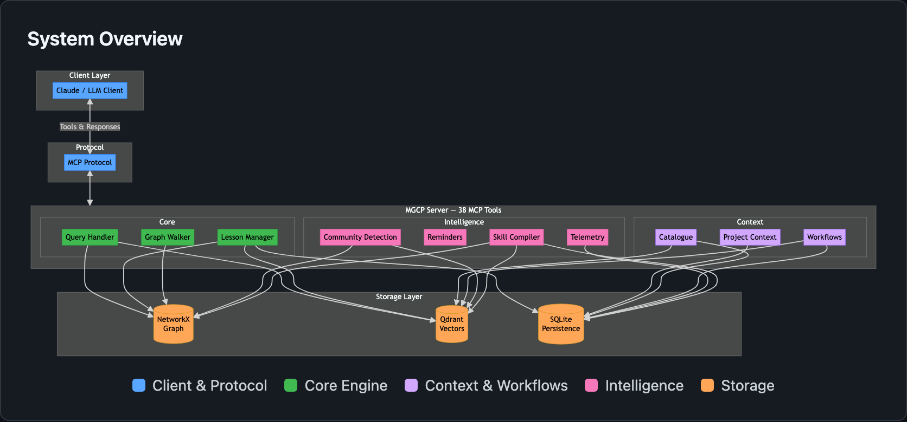
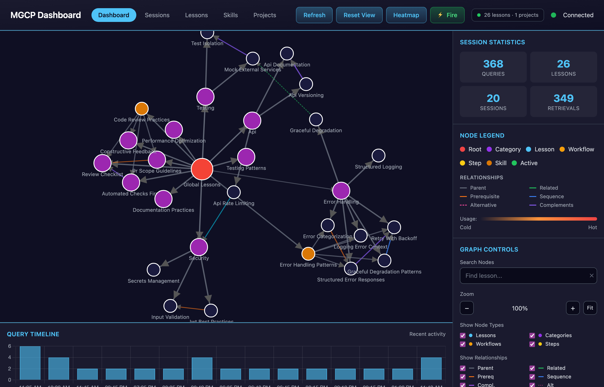
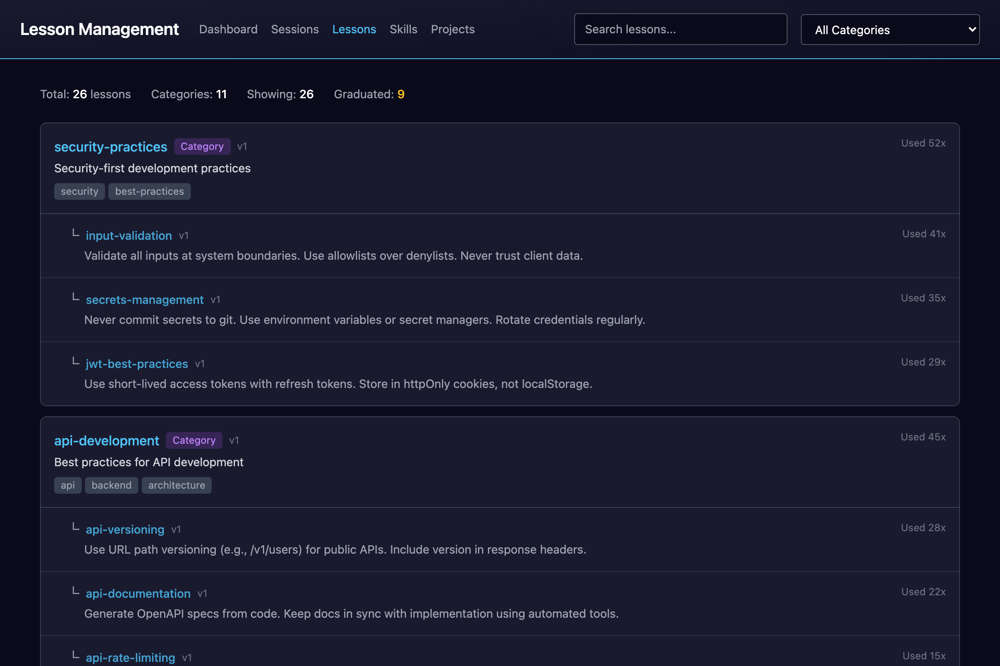
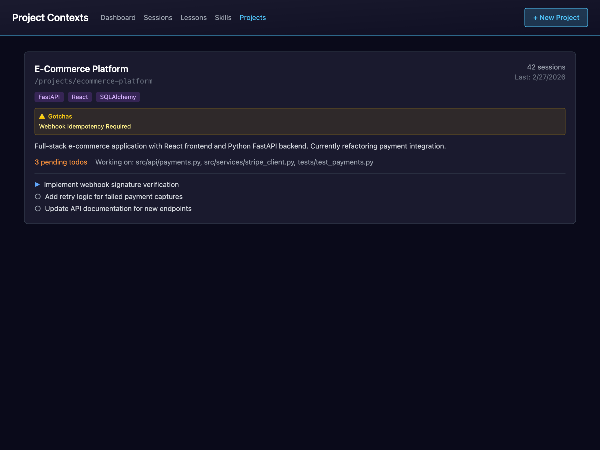

# Memory Graph Core Primitives (MGCP)

**Persistent context for stateless LLMs.**

[](https://osaasy.dev/)
[](https://www.python.org/downloads/)
[](https://modelcontextprotocol.io/)

> **⚠️ Alpha Software** — Actively dogfooding as we build. Working, but APIs may change.

## The Core Problem

LLMs are stateless. Every session starts from zero. The AI that helped you debug authentication yesterday has no memory of it today. Lessons learned, project context, architectural decisions—gone.

You've probably experienced this: explaining the same codebase structure repeatedly, watching the AI make a mistake you corrected last week, or losing important context when a session ends.

## What MGCP Does

MGCP gives your LLM **persistent context that survives session boundaries**.

```
Session 1: LLM encounters a bug → adds lesson → stored in database

Session 2: LLM has no memory of Session 1
         → Hook fires: "query lessons before coding"
         → Semantic search returns relevant lesson
         → Bug avoided
```

**The primary audience is the LLM, not you.** You configure the system; the LLM reads from and writes to it. The knowledge persists even though the LLM doesn't.

### What makes this powerful:

- **Semantic search** finds relevant lessons without exact keyword matches
- **Graph relationships** surface connected knowledge together
- **Workflows** ensure multi-step processes aren't shortcut
- **Hooks** make it proactive—reminders fire automatically at key moments
- **Project isolation** keeps context separate per codebase

### What this is NOT:

- Not "AI that learns" — lessons are added explicitly
- Not self-improving — you/the LLM improve it by adding better content
- Not magic — it's structured context injection with good tooling

**Honest framing:** This is a persistent knowledge store with semantic search, workflow orchestration, and proactive reminders. The value is *continuity*—accumulated guidance that shapes LLM behavior across sessions.

## Real Value Delivered

In active use, MGCP has:

- **Caught bugs before they happened** — lessons from past mistakes surface before repeating them
- **Kept documentation in sync** — workflow steps enforce doc review before commits
- **Maintained project context** — picking up exactly where the last session left off
- **Enforced quality gates** — workflows with checklists prevent skipped steps
- **Preserved architectural decisions** — rationale survives session boundaries

The system isn't intelligent. But an LLM with accumulated context *behaves* more intelligently than one starting fresh every time.

## How It Works

<picture>
  <source media="(prefers-color-scheme: dark)" srcset="docs/screenshots/architecture-dark.png">
  <source media="(prefers-color-scheme: light)" srcset="docs/screenshots/architecture-light.png">
  
</picture>

| Component | Purpose |
|-----------|---------|
| **SQLite** | Lessons, project contexts, telemetry |
| **Qdrant** | Vector embeddings for semantic search |
| **NetworkX** | In-memory graph for relationship traversal |
| **MCP Protocol** | Native integration with LLM clients |
| **Hooks** | Proactive reminders at key moments |

## Key Concepts

### Lessons
Knowledge with triggers and actions:
```
id: "verify-method-exists"
trigger: "api endpoint, database call, store method"
action: "BEFORE calling any method, verify it exists in the class"
rationale: "We once shipped code calling store._get_conn() which didn't exist"
```

When the LLM queries "working on api endpoint", this lesson surfaces.

### Workflows
Step-by-step processes with linked lessons:
```
workflow: api-endpoint-development
steps:
  1. Design → linked lessons: [api-contract, error-responses]
  2. Implement → linked lessons: [verify-method-exists]
  3. Test → linked lessons: [manual-ui-test-required]
  4. Document → linked lessons: [update-openapi]
```

Each step surfaces relevant guidance. Checklists prevent skipping.

### Project Context
Per-project state that persists:
- **Todos** with status (pending/in_progress/completed/blocked)
- **Decisions** with rationale (why we chose X over Y)
- **Catalogue** (architecture notes, security concerns, conventions)
- **Active files** being worked on

Session 47 knows what Session 46 was doing.

### Reminders
Self-directed prompts for multi-step work:
```python
schedule_reminder(
    after_calls=2,
    message="EXECUTE the Test step before responding",
    workflow_step="api-endpoint-development/test"
)
```

The LLM reminds itself to not skip steps.

## Screenshots

### Knowledge Graph Dashboard
Interactive visualization with usage heatmaps and real-time updates.


### Lesson Management
Browse, search, and manage lessons with relationship tracking.


### Project Catalogue
Architecture notes, security concerns, conventions, decisions.


## Quick Start

### 1. Install

```bash
git clone https://github.com/devnullnoop/MGCP.git
cd MGCP
python3 -m venv .venv
source .venv/bin/activate
python check_install.py --install
```

### 2. Configure Your LLM Client

```bash
mgcp-init
```

Supports: Claude Code, Claude Desktop, Cursor, Windsurf, Zed, Continue, Cline, Sourcegraph Cody

### 3. Start Using

Restart your LLM client. MGCP tools are now available.

```bash
# Optional: Start the dashboard
mgcp-dashboard
```

## MCP Tools (38 total)

### Lesson Discovery (5)
| Tool | Purpose |
|------|---------|
| `query_lessons` | Semantic search for relevant lessons |
| `get_lesson` | Get full lesson details |
| `spider_lessons` | Traverse related lessons |
| `list_categories` | Browse lesson hierarchy |
| `get_lessons_by_category` | Get lessons in a category |

### Lesson Management (4)
| Tool | Purpose |
|------|---------|
| `add_lesson` | Create a new lesson |
| `refine_lesson` | Improve existing lesson |
| `link_lessons` | Create typed relationships |
| `delete_lesson` | Remove lesson from all stores |

### Project Context (5)
| Tool | Purpose |
|------|---------|
| `get_project_context` | Load saved context |
| `save_project_context` | Persist for next session |
| `add_project_todo` | Add todo item |
| `update_project_todo` | Update todo status |
| `list_projects` | List all projects |

### Project Catalogue (11)
| Tool | Purpose |
|------|---------|
| `search_catalogue` | Semantic search catalogue |
| `add_catalogue_arch_note` | Architecture notes/gotchas |
| `add_catalogue_security_note` | Security concerns |
| `add_catalogue_dependency` | Track dependencies |
| `add_catalogue_convention` | Coding conventions |
| `add_catalogue_coupling` | File dependencies |
| `add_catalogue_decision` | Decisions with rationale |
| `add_catalogue_error_pattern` | Error solutions |
| `add_catalogue_custom_item` | Flexible custom items |
| `remove_catalogue_item` | Remove item |
| `get_catalogue_item` | Get item details |

### Workflows (8)
| Tool | Purpose |
|------|---------|
| `list_workflows` | List available workflows |
| `query_workflows` | Match task to workflow |
| `get_workflow` | Get workflow with steps |
| `get_workflow_step` | Get step with lessons |
| `create_workflow` | Create workflow |
| `update_workflow` | Update workflow |
| `add_workflow_step` | Add step |
| `link_lesson_to_workflow_step` | Link lesson to step |

### Community Detection (3)
| Tool | Purpose |
|------|---------|
| `detect_communities` | Auto-detect topic clusters via Louvain |
| `save_community_summary` | Persist LLM-generated community summary |
| `search_communities` | Semantic search community summaries |

### Reminders (2)
| Tool | Purpose |
|------|---------|
| `schedule_reminder` | Schedule self-reminder |
| `reset_reminder_state` | Clear reminders |

## Claude Code Hooks

Hooks make the system proactive:

| Hook | Trigger | Purpose |
|------|---------|---------|
| `session-init.py` | Session start | Load context, query lessons |
| `git-reminder.py` | "commit", "push" | Query git lessons first |
| `task-start-reminder.py` | "fix", "implement" | Activate relevant workflow |
| `catalogue-reminder.py` | Library/security mentions | Remind to catalogue |
| `mgcp-precompact.py` | Before compression | Save before context lost |

Without hooks, the LLM must remember to query. With hooks, it happens automatically.

## Commands

| Command | Description |
|---------|-------------|
| `mgcp-init` | Configure for your LLM client |
| `mgcp` | Start MCP server |
| `mgcp-bootstrap` | Seed initial lessons |
| `mgcp-dashboard` | Start web UI |
| `mgcp-export` | Export lessons |
| `mgcp-import` | Import lessons |
| `mgcp-duplicates` | Find duplicates |
| `mgcp-backup` | Backup/restore |

## API & Dashboard

| Endpoint | Description |
|----------|-------------|
| `GET /api/health` | Health check |
| `GET /api/lessons` | All lessons |
| `GET /api/projects` | All projects |
| `GET /api/graph` | Graph visualization data |
| `GET /docs` | OpenAPI documentation |
| `WS /ws/events` | Real-time events |

## Beyond Software Development

The architecture is domain-agnostic. Replace our bootstrap with:

| Domain | Example Lessons |
|--------|-----------------|
| **Customer Service** | Escalation triggers, resolution patterns |
| **Sales** | Objection handling, deal stage guidance |
| **Medical** | Symptom assessment, triage protocols |
| **Legal** | Document review, clause risk patterns |
| **Education** | Learning adaptation, concept explanations |

Same tools, different content.

## Potential Applicability to Agentic Workflows

> **Note:** We have not built or tested this. Our focus is development workflows. The following is speculation about what the architecture *could* support—not a proven capability.

Any agent operating across invocations faces statelessness. The components here—lessons, workflows, semantic search, hooks—could theoretically address that for agentic systems beyond coding assistants. We haven't tried it, but the pieces are:

| Component | Potential Use |
|-----------|---------------|
| `add_lesson` / `refine_lesson` | Agent captures patterns from outcomes |
| `query_lessons` | Agent retrieves relevant guidance before acting |
| `workflows` | Multi-step processes with enforcement |
| Hooks (event triggers) | Inject context at decision points |

This wouldn't be machine learning—it would be **systematic accumulation** through explicit capture. The agent (or human) would need to add lessons when relevant; nothing is automatic.

A hypothetical multi-agent pattern:

```
Agent A completes task → explicitly adds lesson about edge case

Agent B starts related task → queries lessons → edge case surfaces
```

**What would be required to actually try this:**
- Hooks/triggers integrated with your agent framework's events
- Discipline around lesson capture (garbage in, garbage out)
- Tuning of triggers to match how your agents describe tasks

If someone tries this, we'd be interested to hear how it goes. The architecture is domain-agnostic; whether it's useful for orchestration is an open question.

## Project Status

| Phase | Status |
|-------|--------|
| Basic Storage & Retrieval | ✅ Complete |
| Semantic Search | ✅ Complete |
| Graph Traversal | ✅ Complete |
| Refinement & Learning | ✅ Complete |
| Quality of Life | ✅ Complete |
| Proactive Intelligence | 🔄 In Progress |

## Contributing

Contributions welcome. See [CONTRIBUTING.md](CONTRIBUTING.md).

## License

[O'Saasy License](https://osaasy.dev/) — Free to use, modify, distribute.

---

Built with the [Model Context Protocol](https://modelcontextprotocol.io/).