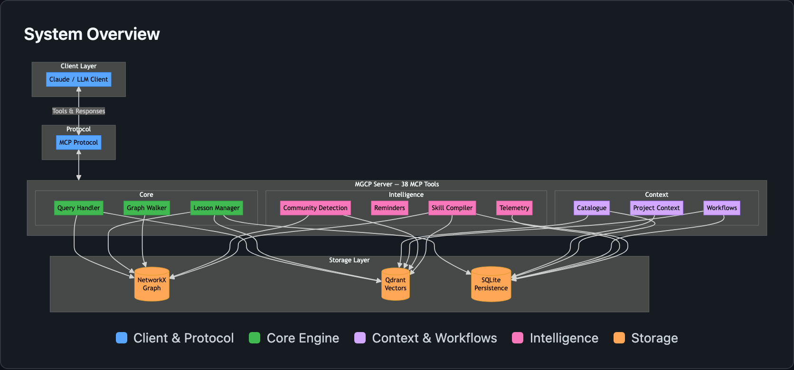
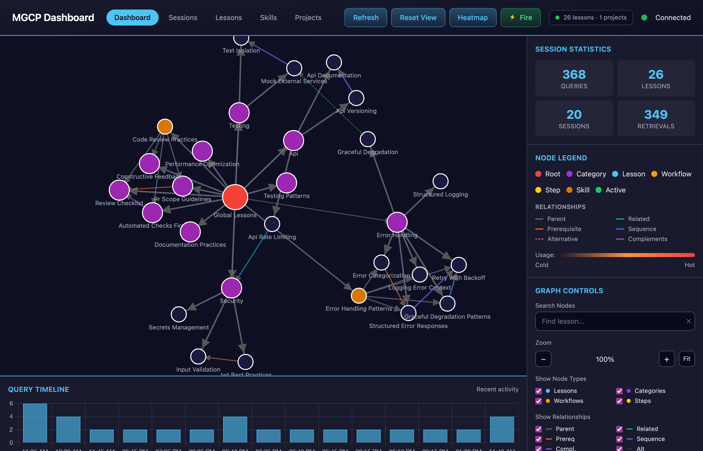
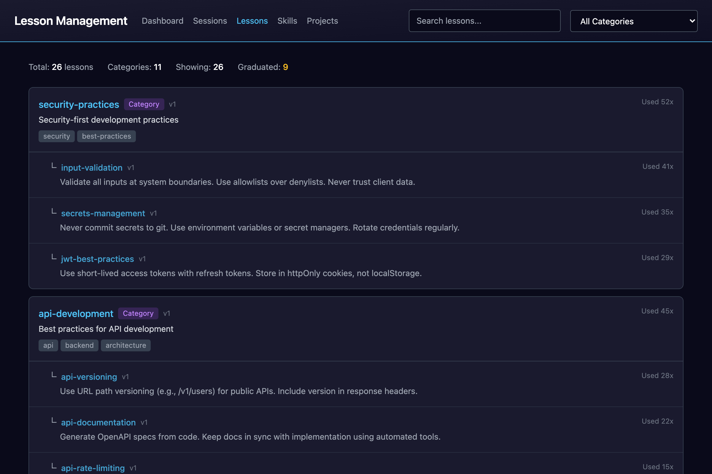
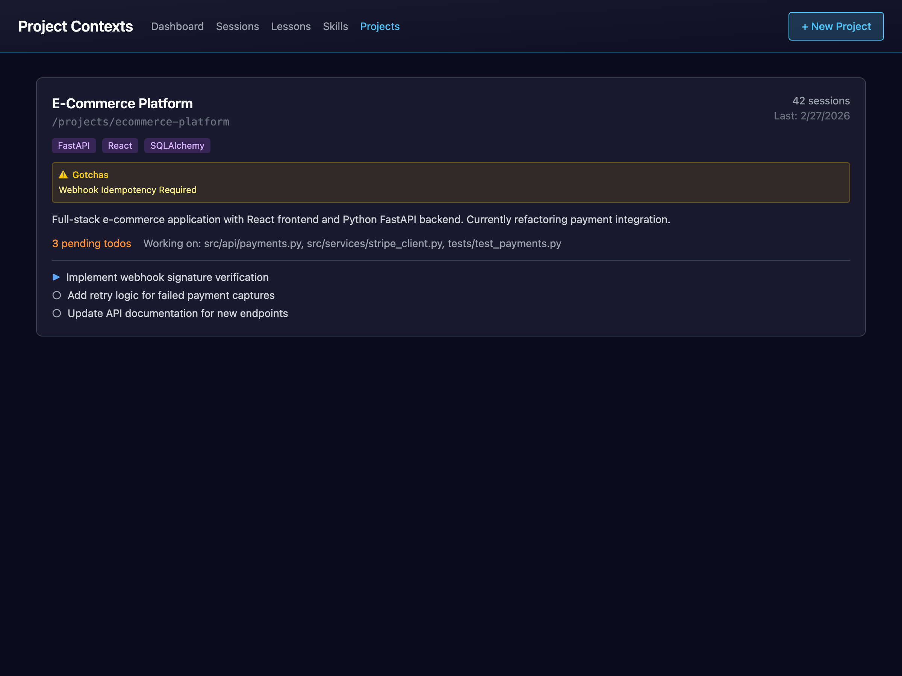
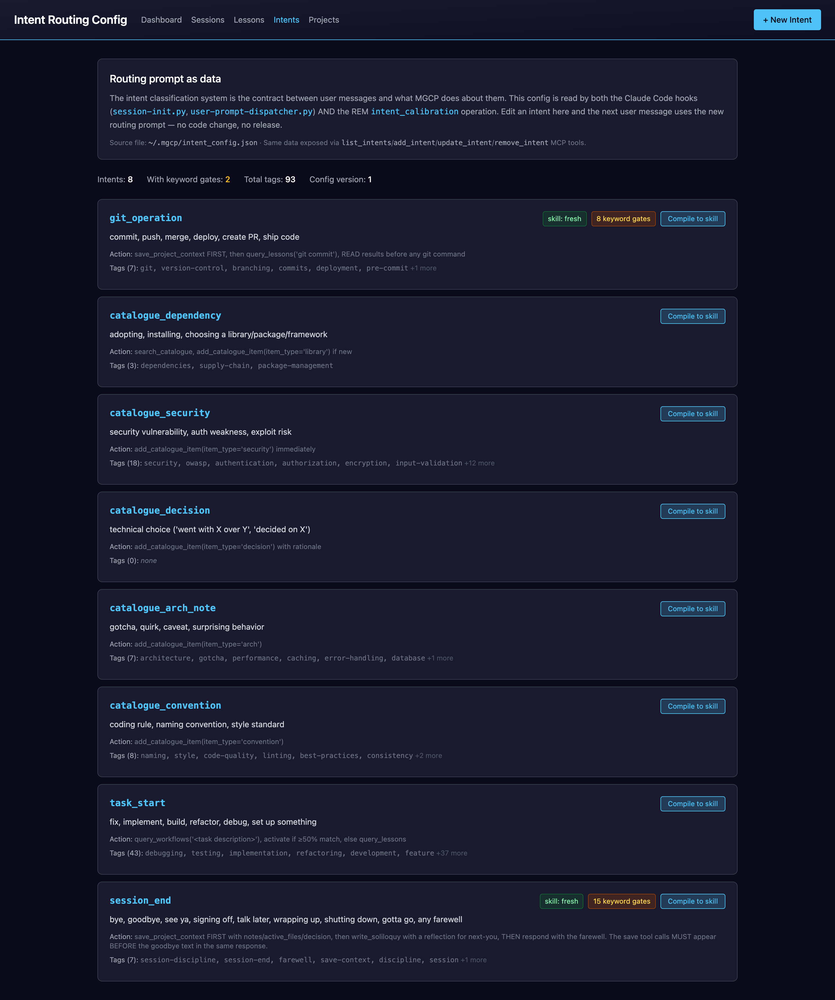

# Memory Graph Core Primitives (MGCP)

**Persistent context for stateless LLMs.**

[](https://osaasy.dev/)
[](https://www.python.org/downloads/)
[](https://modelcontextprotocol.io/)

> **Alpha Software** - Actively dogfooding as we build. Working, but APIs may change.

## The Problem

LLMs are stateless. Every session starts from zero. The AI that helped you debug authentication yesterday has no memory of it today. Lessons learned, project context, architectural decisions - all gone the moment the session ends.

You've seen it: explaining the same codebase structure over and over, watching the AI repeat a mistake you corrected last week, losing important context when a session ends.

## What MGCP Does

MGCP gives your LLM **persistent context that survives session boundaries**.

```
Session 1: LLM encounters a bug -> adds lesson -> stored in database

Session 2: LLM has no memory of Session 1
         -> Hook fires: "query lessons before coding"
         -> Semantic search returns relevant lesson
         -> Bug avoided
```

**The primary audience is the LLM, not you.** You configure the system; the LLM reads from and writes to it. The knowledge persists even though the LLM doesn't.

### What makes this useful:

- **Semantic search** finds relevant lessons without exact keyword matches
- **Graph relationships** surface connected knowledge together
- **Workflows** ensure multi-step processes don't get shortcut
- **Hooks** make it proactive - reminders fire automatically at key moments
- **Project isolation** keeps context separate per codebase

### What this is NOT:

- Not "AI that learns" - lessons are added explicitly
- Not self-improving - you (or the LLM) improve it by adding better content
- Not magic - it's structured context injection with good tooling

**Honest framing:** This is a persistent knowledge store with semantic search, workflow orchestration, and proactive reminders. The value is *continuity* - accumulated guidance that shapes LLM behavior across sessions.

## Real Value Delivered

In active use, MGCP has:

- **Caught bugs before they happened** - lessons from past mistakes surface before repeating them
- **Kept documentation in sync** - workflow steps enforce doc review before commits
- **Maintained project context** - picking up exactly where the last session left off
- **Enforced quality gates** - workflows with checklists prevent skipped steps
- **Preserved architectural decisions** - rationale survives session boundaries

The system isn't intelligent. But an LLM with accumulated context *behaves* more intelligently than one starting fresh every time.

## How It Works

<picture>
  <source media="(prefers-color-scheme: dark)" srcset="docs/screenshots/architecture-dark.png">
  <source media="(prefers-color-scheme: light)" srcset="docs/screenshots/architecture-light.png">
  
</picture>

| Component | Purpose |
|-----------|---------|
| **SQLite** | Lessons, project contexts, telemetry |
| **Qdrant** | Vector embeddings for semantic search |
| **NetworkX** | In-memory graph for relationship traversal |
| **MCP Protocol** | Native integration with LLM clients |
| **Hooks** | Proactive reminders at key moments |

## Key Concepts

### Lessons
Knowledge with triggers and actions:
```
id: "verify-method-exists"
trigger: "api endpoint, database call, store method"
action: "BEFORE calling any method, verify it exists in the class"
rationale: "We once shipped code calling store._get_conn() which didn't exist"
```

When the LLM queries "working on api endpoint", this lesson surfaces.

### Workflows
Step-by-step processes with linked lessons:
```
workflow: api-endpoint-development
steps:
  1. Design -> linked lessons: [api-contract, error-responses]
  2. Implement -> linked lessons: [verify-method-exists]
  3. Test -> linked lessons: [manual-ui-test-required]
  4. Document -> linked lessons: [update-openapi]
```

Each step surfaces relevant guidance. Checklists prevent skipping.

### Project Context
Per-project state that persists:
- **Todos** with status (pending/in_progress/completed/blocked)
- **Decisions** with rationale (why we chose X over Y)
- **Catalogue** (architecture notes, security concerns, conventions)
- **Active files** being worked on

Session 47 knows what Session 46 was doing.

### Reminders
Self-directed prompts for multi-step work:
```python
schedule_reminder(
    after_calls=2,
    message="EXECUTE the Test step before responding",
    workflow_step="api-endpoint-development/test"
)
```

The LLM reminds itself to not skip steps.

## Screenshots

### Knowledge Graph Dashboard
Interactive visualization with usage heatmaps and real-time updates.


### Lesson Management
Browse, search, and manage lessons with relationship tracking.


### Project Catalogue
Architecture notes, security concerns, conventions, decisions.


### Intent Routing Config (v2.2)
The routing prompt is data, not code. Edit intents in the UI (or via `add_intent`/`update_intent` MCP tools, or directly in `~/.mgcp/intent_config.json`). REM intent_calibration writes back to this same file when community detection finds misfit clusters.


## Quick Start

### 1. Install

**Requires Python 3.11 or 3.12.** Python 3.13 is not supported (PyTorch has no wheels for it on Intel Macs).

```bash
git clone https://github.com/devnullnoop/MGCP.git
cd MGCP
python3.12 -m venv .venv
source .venv/bin/activate
pip install -e .
```

### 2. Configure Your LLM Client

```bash
mgcp-init
```

This will:
- Auto-detect installed LLM clients and configure the MCP server
- Deploy global hooks (Claude Code) for proactive reminders
- **Download the embedding model (~415MB) on first run** — this powers semantic search and only needs to happen once. Subsequent runs are instant.

Supports: Claude Code, Claude Desktop, Cursor, Windsurf, Zed, Continue, Cline, Sourcegraph Cody

### 3. Start Using

Restart your LLM client. MGCP tools are now available.

```bash
# Optional: seed starter lessons and workflows
mgcp-bootstrap

# Optional: start the web dashboard
mgcp-dashboard
```

## MCP Tools (49 total)

### Lesson Discovery (5)
| Tool | Purpose |
|------|---------|
| `query_lessons` | Semantic search for relevant lessons |
| `get_lesson` | Get full lesson details |
| `spider_lessons` | Traverse related lessons |
| `list_categories` | Browse lesson hierarchy |
| `get_lessons_by_category` | Get lessons in a category |

### Lesson Management (4)
| Tool | Purpose |
|------|---------|
| `add_lesson` | Create a new lesson |
| `refine_lesson` | Improve existing lesson |
| `link_lessons` | Create typed relationships |
| `delete_lesson` | Remove lesson from all stores |

### Project Context (5)
| Tool | Purpose |
|------|---------|
| `get_project_context` | Load saved context |
| `save_project_context` | Persist for next session |
| `add_project_todo` | Add todo item |
| `update_project_todo` | Update todo status |
| `list_projects` | List all projects |

### Project Catalogue (4)
| Tool | Purpose |
|------|---------|
| `search_catalogue` | Semantic search catalogue |
| `add_catalogue_item` | Add any item (arch, security, library, convention, coupling, decision, error, or custom) |
| `remove_catalogue_item` | Remove item |
| `get_catalogue_item` | Get item details |

### Workflows (8)
| Tool | Purpose |
|------|---------|
| `list_workflows` | List available workflows |
| `query_workflows` | Match task to workflow |
| `get_workflow` | Get workflow with steps |
| `get_workflow_step` | Get step with lessons |
| `create_workflow` | Create workflow |
| `update_workflow` | Update workflow |
| `add_workflow_step` | Add step |
| `link_lesson_to_workflow_step` | Link lesson to step |

### Community Detection (3)
| Tool | Purpose |
|------|---------|
| `detect_communities` | Auto-detect topic clusters via Louvain |
| `save_community_summary` | Persist LLM-generated community summary |
| `search_communities` | Semantic search community summaries |

### REM Cycle (3)

Knowledge stores rot. Lessons go stale, duplicates accumulate, and topic clusters shift as a project evolves. REM (Recalibrate Everything in Memory) runs periodic consolidation to keep the knowledge base healthy without manual curation.

Each operation runs on its own schedule — staleness scans every 5 sessions, duplicate detection every 10, community detection on fibonacci intervals (5, 8, 13, 21...), knowledge extraction on a logarithmic curve that starts frequent and slows down as the project matures. The schedules are configurable but the defaults work well in practice.

| Tool | Purpose |
|------|---------|
| `rem_run` | Run consolidation cycle (staleness, duplicates, communities) |
| `rem_report` | View last cycle's findings |
| `rem_status` | Show schedule state and what's due |

### Workflow State (1)
| Tool | Purpose |
|------|---------|
| `update_workflow_state` | Track active workflow and step progress |

### Reminders (2)
| Tool | Purpose |
|------|---------|
| `schedule_reminder` | Schedule self-reminder |
| `reset_reminder_state` | Clear reminders |

### Enforcement Rules (6)
Data-driven gates for the PreToolUse hook. Edits take effect on the next tool call.
| Tool | Purpose |
|------|---------|
| `list_enforcement_rules` | List all configured rules |
| `get_enforcement_rule` | Full definition of one rule |
| `add_enforcement_rule` | Add a new rule (trigger + preconditions + bypass scope + deny reason) |
| `update_enforcement_rule` | Change fields on an existing rule |
| `remove_enforcement_rule` | Delete a rule |
| `toggle_enforcement_rule` | Enable/disable without deleting |

## Claude Code Hooks

### The problem with regex routing

MGCP v1 used dedicated hook scripts to detect user intent from message text. `git-reminder.py` matched keywords like "commit" and "push". `catalogue-reminder.py` matched library names. `task-start-reminder.py` matched "fix", "implement", etc. Three scripts, hundreds of lines of regex patterns, and they missed nearly half of real user messages.

The failure mode was predictable: users don't say "let's commit this" — they say "ship it", "we're done here, push it up", or "ready to merge". Regex can't keep up with natural language variation. We also tested graph-community classification (embed the message, search community summaries) but it performed even worse — communities describe topics, not actions.

### LLM self-routing

v2 replaces all three regex hooks with a single routing prompt injected at session start (~800 tokens). The LLM classifies each message into 7 intent categories using its own language understanding, then follows an intent-action map to call the right tools.

We benchmarked all three approaches against a ground-truth corpus covering direct phrasing, indirect phrasing, false positives, multi-intent, no intent, and edge cases. LLM self-routing improved accuracy by ~50% over regex while cutting the hook codebase nearly in half. Graph-community classification was not competitive for intent detection (it remains valuable for knowledge retrieval, just not action classification).

### v2.2: routing prompt as data

LLM self-routing was a leap, but it was still hard-coded — three places had to be edited to add an intent (both hooks plus REM's `tag_to_intent` dict), and REM's intent_calibration findings were advisory only because there was no writeback path. v2.2 makes the routing prompt **data**: the canonical intent definitions live in `~/.mgcp/intent_config.json`, both hooks read pre-rendered prompt sections from that file, and REM intent_calibration loads from the same file. New `add_intent`/`update_intent`/`remove_intent` MCP tools let the LLM (or REM, or a human) modify the config from chat — the next session's hook injection picks up the change automatically. No code commit, no release.

A new `session_end` intent was added to fix a real failure mode that v2.1 silently ignored: messages like "bye bye now" had no intent classification, no keyword gate, and no calibration finding flagging the gap. v2.2 also adds a coherence check to REM intent_calibration — when a community spans multiple intents with no clear dominant (< 60% share), it surfaces a finding suggesting a new intent or tag remap. This catches misfit clusters that defensive over-mapping in v2.1 silenced.

### v2.3: compile intents to portable skills

Anthropic's plugin system distributes prompt-only "skills" as `SKILL.md` files in `~/.claude/skills/`. Once installed, a skill is invocable as a slash command (`/skill_name`) and auto-discoverable by Claude via its frontmatter description. v2.3 adds a compiler that takes any MGCP intent + its linked workflow + the workflow's per-step lessons and renders all four layers into a single SKILL.md — turning MGCP's accumulated discipline into a portable artifact you can use even in Claude surfaces that don't have MGCP installed.

The compiled skill is **purely additive**. The intent stays in `intent_config.json` and continues to drive the hook keyword gates and LLM intent classification. Backing lessons stay in the active query pool. Compiling does not remove, hide, or graduate anything. This is the inverse of the Phase 8 skill compilation that was removed for degrading reliability — Phase 8 graduated lessons out of `query_lessons`, which hid knowledge from the LLM. v2.3 keeps the source of truth in MGCP and treats the SKILL.md as a downstream export format that can be recompiled at any time.

A new `compile_intent_to_skill` MCP tool, a `POST /api/intent-config/intents/{name}/compile` web endpoint, and a "Compile to skill" button on the `/intents` page all converge on the same `compile_intent_to_skill()` function. The web UI badges compiled skills as **fresh** (green) or **stale** (orange) by comparing the SKILL.md mtime against the backing lessons' `last_refined` timestamps and the `intent_config.json` mtime, so users know when to recompile.

### v2.3 hook templates: enforcement, not just advice

All prior hooks (SessionStart, UserPromptSubmit, PostToolUse, PreCompact) are **advisory** — they inject text as `<system-reminder>` tags that the LLM can skim or ignore. The `query-before-git-operations` lesson failed v1 → v4 across months despite the hook firing correctly every time; interception was not compliance.

v2.3 adds a `PreToolUse` hook (`pre-tool-dispatcher.py`) that can actually refuse a tool call by returning `permissionDecision: "deny"`. First enforced rule: `git commit` / `git push` is blocked unless `mcp__mgcp__query_lessons` ran in the same turn. The detector uses quote-aware tokenization (`shlex` with `punctuation_chars=True`), so `grep 'git commit' docs/` and `echo "how to git commit"` correctly pass through while `make build && git push` correctly blocks. See `docs/mgcp-interception-flow.html` for the full interception map, the growth loop, and candidate improvement areas.

### v2.4: enforcement-as-data

v2.3 introduced enforcement but the rule was **hardcoded** in the hook. Adding a new interrupt — "before `rm -rf`, require a confirmation tool", "if you staged `src/**.py`, you must also stage `CHANGELOG.md`" — meant editing Python and shipping a release. That's the same drift pattern v2.2 fixed for intent routing.

v2.4 makes the routing prompt's philosophy universal: **enforcement is now data**. Rules live in `~/.mgcp/enforcement_rules.json`. The `pre-tool-dispatcher.py` hook is a generic stdlib-only evaluator — it reads the JSON on every tool call and applies every enabled, triggered, non-bypassed rule. Adding a new rule is a chat-time `add_enforcement_rule` call; the next tool call picks it up with no restart.

Each rule has three parts: a **trigger** (which tool calls it matches — tool name plus optional Bash-command matcher: `git_subcommand`, `regex`, or `contains`), one or more **preconditions** (`tool_called_this_turn`, `tool_not_called_this_turn`, `staged_files_coupling`), and a **bypass_scope** (short token like `"git"` or `"docs"` the user can name in `MGCP_BYPASS:<scope>` to disable that rule for one turn; bare `MGCP_BYPASS` disables all).

Six new MCP tools (`list_enforcement_rules`, `get_enforcement_rule`, `add_enforcement_rule`, `update_enforcement_rule`, `remove_enforcement_rule`, `toggle_enforcement_rule`) let the LLM — or a human — CRUD rules from chat. The `git-requires-query-lessons` rule from v2.3 is preserved as a seeded default. Tool count: 43 → 49.

### v2.5: SessionStart dedup

The `session-init.py` hook previously injected a full `<intent-routing>` + `<intent-actions>` pair on top of the per-turn copy already rendered by `user-prompt-dispatcher.py`. Two copies of the same 8-intent choreography in the same conversation — competing for attention and burning ~300 tokens per session — with no behavioral payoff, since the dispatcher block survives context compaction and the SessionStart block did not carry any information the dispatcher didn't.

v2.5 drops the SessionStart copy. The hook now carries only the bootstrap checklist (`read_soliloquy` / `get_project_context` / `query_lessons`) and the workflow execution discipline. SessionStart injection drops ~2500 → ~1050 chars. The dispatcher is unchanged. This walks back an earlier sketch of moving intent classification into the hook (keyword regex) — that direction would have regressed to the legacy hooks archived in `examples/claude-hooks/legacy/`; classification stays LLM-side and enforcement rules catch misclassification at tool-call time regardless.

### Current hooks

| Hook | Event | Type | Purpose |
|------|-------|------|---------|
| `session-init.py` | SessionStart | advisory | Inject the session-start bootstrap checklist (read_soliloquy / get_project_context / query_lessons) and workflow execution discipline. (v2.5: no longer duplicates the dispatcher's routing/actions block.) |
| `user-prompt-dispatcher.py` | UserPromptSubmit | advisory | Hard keyword gates (data-driven from `intent_config.json` — both git and session_end fire from one loop), full classifier+actions re-injection every message, scheduled reminders, workflow state, per-turn enforcement state reset |
| `pre-tool-dispatcher.py` | PreToolUse | **enforcing** | Generic evaluator reading `~/.mgcp/enforcement_rules.json`. Applies every enabled rule; denies when preconditions unsatisfied. Scoped bypass via `MGCP_BYPASS:<scope>` or bare `MGCP_BYPASS` |
| `post-tool-dispatcher.py` | PostToolUse | advisory | Routes by tool: Edit/Write triggers knowledge-capture; Bash triggers error detection; appends every tool name to `turn_tools_called` for PreToolUse rules |
| `mgcp-precompact.py` | PreCompact | advisory | Save context (and write_soliloquy) before compression |

The dispatcher falls back to a minimal hard-coded intent set if the JSON file is missing or corrupt — a fresh install never crashes a hook. Legacy regex hooks (`git-reminder.py`, `catalogue-reminder.py`, `task-start-reminder.py`) are archived in `examples/claude-hooks/legacy/`.

## Commands

| Command | Description |
|---------|-------------|
| `mgcp-init` | Configure LLM clients, deploy hooks, download embedding model |
| `mgcp` | Start MCP server |
| `mgcp-bootstrap` | Seed initial lessons and workflows |
| `mgcp-dashboard` | Start web UI |
| `mgcp-export` | Export lessons/projects to JSON |
| `mgcp-import` | Import lessons from JSON |
| `mgcp-duplicates` | Find semantically similar lessons |
| `mgcp-backup` | Backup/restore all MGCP data |
| `mgcp-migrate` | Migrate from ChromaDB to Qdrant (legacy installs) |

## API & Dashboard

| Endpoint | Description |
|----------|-------------|
| `GET /api/health` | Health check |
| `GET /api/lessons` | All lessons |
| `GET /api/projects` | All projects |
| `GET /api/graph` | Graph visualization data |
| `GET /docs` | OpenAPI documentation |
| `WS /ws/events` | Real-time events |

## Beyond Software Development

The architecture is domain-agnostic. Replace the bootstrap with your own content:

| Domain | Example Lessons |
|--------|-----------------|
| **Customer Service** | Escalation triggers, resolution patterns |
| **Sales** | Objection handling, deal stage guidance |
| **Medical** | Symptom assessment, triage protocols |
| **Legal** | Document review, clause risk patterns |
| **Education** | Learning adaptation, concept explanations |

Same tools, different content.

## Agentic Workflows

> **Note:** We haven't built or tested this. Our focus is development workflows. The following is speculation about what the architecture *could* support.

Any agent operating across invocations faces statelessness. The components here - lessons, workflows, semantic search, hooks - could theoretically address that for agentic systems beyond coding assistants. We haven't tried it, but the pieces are there:

| Component | Potential Use |
|-----------|---------------|
| `add_lesson` / `refine_lesson` | Agent captures patterns from outcomes |
| `query_lessons` | Agent retrieves relevant guidance before acting |
| `workflows` | Multi-step processes with enforcement |
| Hooks (event triggers) | Inject context at decision points |

This wouldn't be machine learning - it would be **systematic accumulation** through explicit capture. The agent (or human) would need to add lessons when relevant; nothing is automatic.

A hypothetical multi-agent pattern:

```
Agent A completes task -> explicitly adds lesson about edge case

Agent B starts related task -> queries lessons -> edge case surfaces
```

**What would be required to actually try this:**
- Hooks/triggers integrated with your agent framework's events
- Discipline around lesson capture (garbage in, garbage out)
- Tuning of triggers to match how your agents describe tasks

If someone tries this, we'd be interested to hear how it goes.

## Project Status

| Phase | Status |
|-------|--------|
| Basic Storage & Retrieval | Complete |
| Semantic Search | Complete |
| Graph Traversal | Complete |
| Refinement & Learning | Complete |
| Quality of Life | Complete |
| Proactive Intelligence | Complete |
| Feedback Loops (REM) | Complete |
| Skill Compilation | Removed (degraded reliability) |

## Contributing

Contributions welcome. See [CONTRIBUTING.md](CONTRIBUTING.md).

## License

[O'Saasy License](https://osaasy.dev/) - Free for individual and internal use; commercial SaaS requires a license.

---

Built with the [Model Context Protocol](https://modelcontextprotocol.io/).
