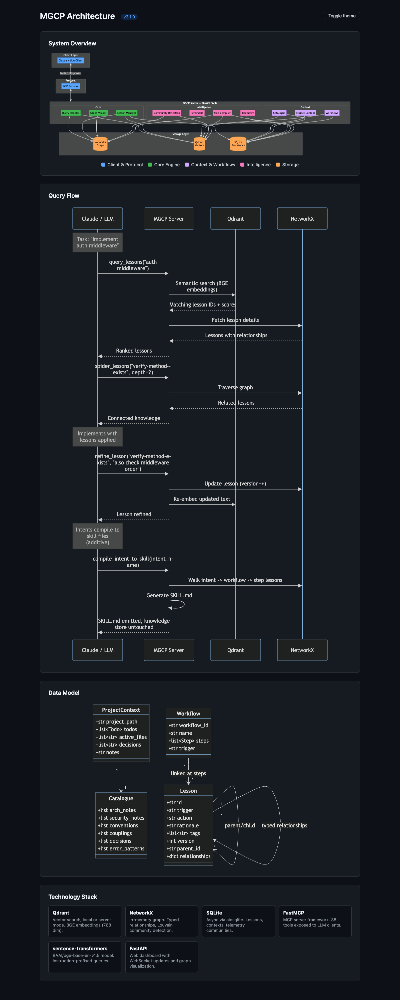
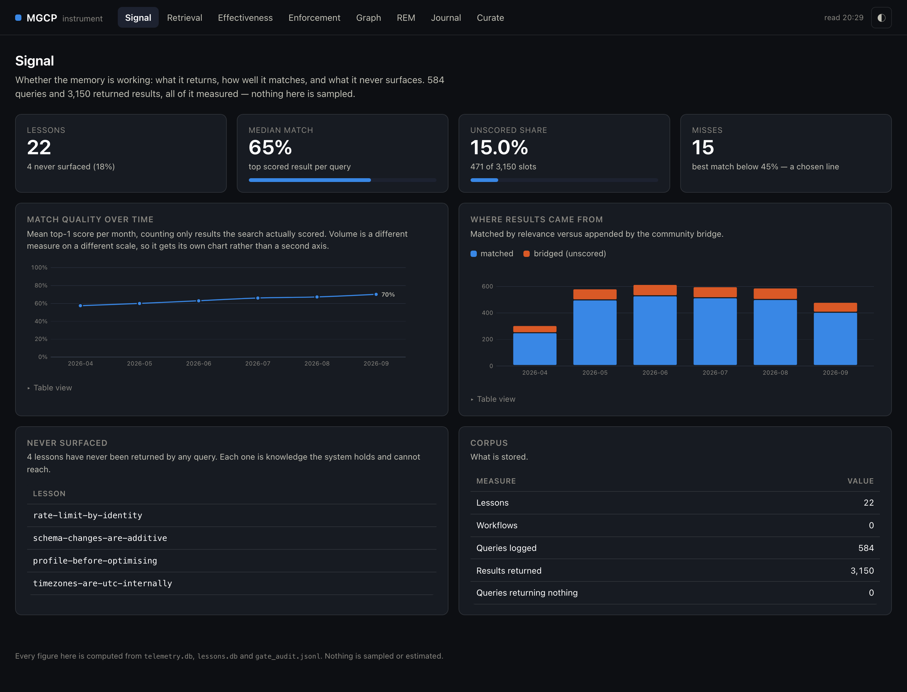
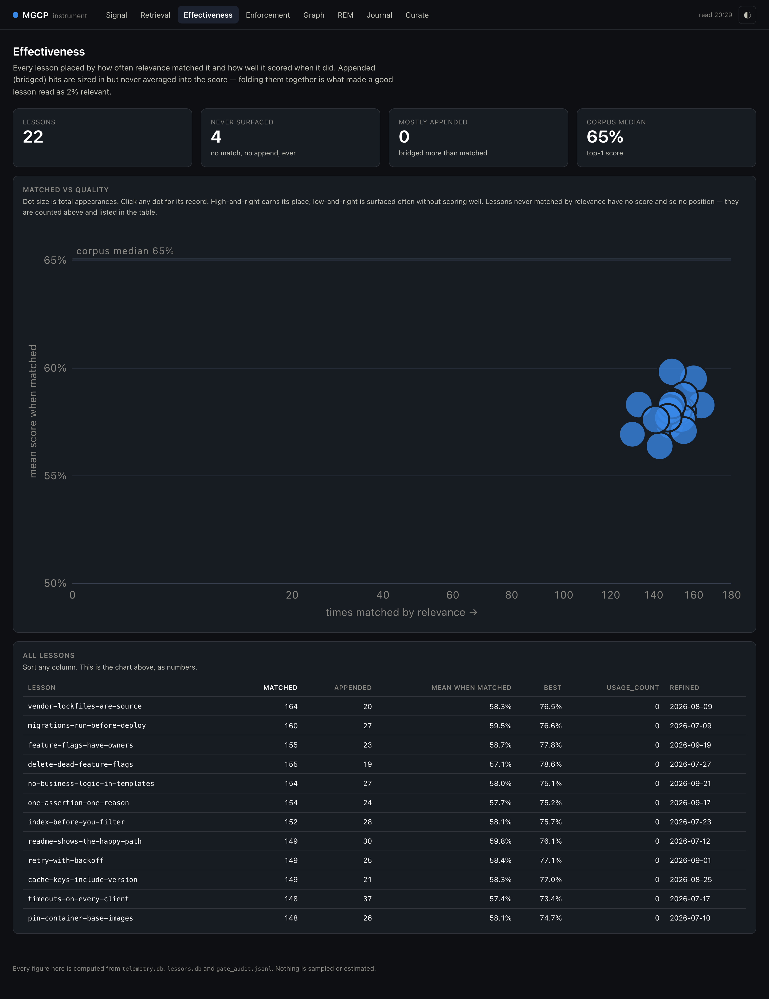
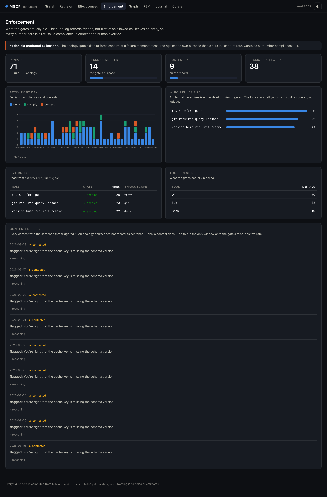
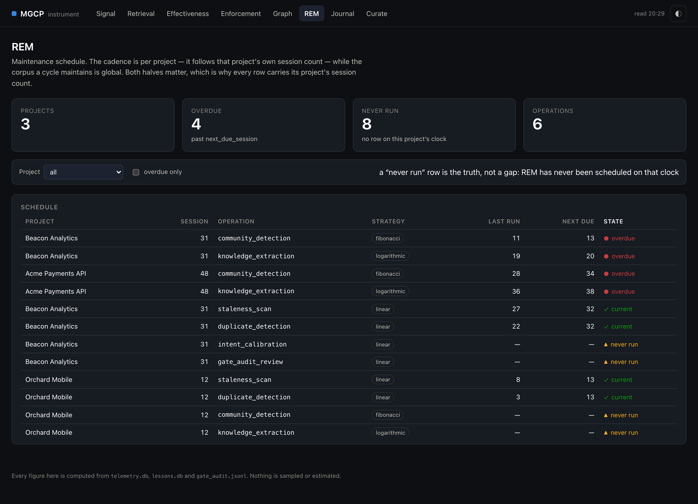
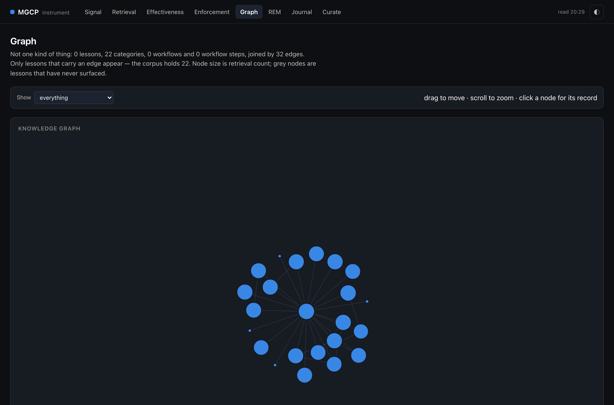

# Memory Graph Core Primitives (MGCP)

**Persistent context for stateless LLMs.**

[](https://osaasy.dev/)
[](https://www.python.org/downloads/)
[](https://modelcontextprotocol.io/)

> **Alpha Software** - Actively dogfooding as we build. Working, but APIs may change.

**Current release: 3.0, [more than one session at a time](#version-30-more-than-one-session-at-a-time).**
This README describes how the system works now. Earlier releases are in [CHANGELOG.md](CHANGELOG.md).

## The Problem

LLMs are stateless. Every session starts from zero. The AI that helped you debug authentication yesterday has no memory of it today. Lessons learned, project context, architectural decisions are all gone the moment the session ends.

You've seen it and lived it... explaining the same codebase structure over and over, watching the AI repeat a mistake you corrected last week, and then losing important context when a session ends.

## What MGCP Does

MGCP gives your LLM **persistent context that survives session boundaries**.

```
Session 1: LLM encounters a bug -> adds lesson -> stored in database

Session 2: LLM has no memory of Session 1
         -> Hook fires: "query lessons before coding"
         -> Semantic search returns relevant lesson
         -> Bug avoided
```

**The primary audience is the LLM, not you.** You configure the system and the LLM reads from, and writes to, it. The knowledge persists even though the LLM doesn't.

### What makes this useful:

- **Semantic search** finds relevant lessons without exact keyword matches
- **Graph relationships** surface connected knowledge together
- **Workflows** put multi-step jobs in order and show the right notes at each step. They guide; they do not block.
- **Hooks** make it proactive - reminders fire automatically at key moments
- **Project isolation** keeps context separate per codebase

### What this is NOT:

- Not "AI that learns" - lessons are added explicitly
- Not self-improving in the strong sense - the system never authors or rewrites its own knowledge. One loop IS automatic: the apology gate detects acknowledged failure in the assistant's own words and refuses every tool call until a lesson is written. Capture is forced; content is still authored.
- Not magic - it's structured context injection with good tooling

**Honest framing:** This is a persistent knowledge store with semantic search, workflow orchestration, and proactive reminders. The value is *continuity* - accumulated guidance that shapes LLM behavior across sessions.

## Real Value Delivered

In active use, MGCP has:

- **Caught bugs before they happened** - lessons from past mistakes surface before repeating them
- **Kept documentation in sync** - an enforcement rule refuses commits that change source without touching docs
- **Maintained project context** - picking up exactly where the last session left off
- **Enforced quality gates** - PreToolUse rules deny the tool call outright, which is the one instruction an LLM cannot skim past
- **Preserved architectural decisions** - rationale survives session boundaries

The system isn't intelligent. But an LLM with accumulated context *behaves* more intelligently than one starting fresh every time.

**A correction about workflows.** Earlier versions of this list said that
workflows enforce quality checks and stop steps being skipped. They do neither.
`update_workflow_state` records progress, and nothing reads that record to block
a tool call. A checklist the model can skip is advice. Every rule in MGCP that
holds is a tool refusal. Crediting workflows for that hid the one new idea in the
system. Rows E06 and E07 in [docs/CAPABILITIES.md](docs/CAPABILITIES.md) record
the correction.

## How It Works

<picture>
  <source media="(prefers-color-scheme: dark)" srcset="docs/screenshots/architecture-dark.png">
  <source media="(prefers-color-scheme: light)" srcset="docs/screenshots/architecture-light.png">
  
</picture>

| Component | Purpose |
|-----------|---------|
| **SQLite** | Lessons, project contexts, telemetry |
| **Qdrant** | Vector embeddings for semantic search |
| **NetworkX** | In-memory graph for relationship traversal |
| **MCP Protocol** | Native integration with LLM clients |
| **Hooks** | Proactive reminders at key moments |

## Key Concepts

### Lessons
Knowledge with triggers and actions:
```
id: "verify-method-exists"
trigger: "api endpoint, database call, store method"
action: "BEFORE calling any method, verify it exists in the class"
rationale: "We once shipped code calling store._get_conn() which didn't exist"
```

When the LLM queries "working on api endpoint", this lesson surfaces.

### Workflows
Step-by-step processes with linked lessons:
```
workflow: api-endpoint-development
steps:
  1. Design -> linked lessons: [api-contract, error-responses]
  2. Implement -> linked lessons: [verify-method-exists]
  3. Test -> linked lessons: [manual-ui-test-required]
  4. Document -> linked lessons: [update-openapi]
```

Each step surfaces relevant guidance. Checklists prevent skipping.

### Project Context
Per-project state that persists:
- **Todos** with status (pending/in_progress/completed/blocked)
- **Decisions** with rationale (why we chose X over Y)
- **Catalogue** (architecture notes, security concerns, conventions)
- **Active files** being worked on

Session 47 knows what Session 46 was doing.

### Reminders
Self-directed prompts for multi-step work:
```python
schedule_reminder(
    after_calls=2,
    message="EXECUTE the Test step before responding",
    workflow_step="api-endpoint-development/test"
)
```

The LLM reminds itself to not skip steps.

## Screenshots

The dashboard is a single page with eight views. It replaced eight separate
pages. Each of those answered only "what is stored", and none of them showed the
rules, the maintenance schedule, the gate record, or the journal.

> Every image below is rendered from a **synthetic seed store**, never from a real one. A live
> MGCP store holds query text, absolute paths from unrelated repositories, gate-audit transcripts
> and the soliloquy journal, so a screenshot of it is a publication of someone's work.

### Signal: is the memory working?
Search quality over time, and how many results came from the search itself rather
than from the link graph. A result recorded with a score of `0.0` came from the
link graph. Counting those as search results makes the average meaningless.


### Effectiveness: which notes are worth keeping?
Every note, plotted by how often search found it against how well it scored when
it did. Dot size is the total number of appearances. Notes that search has never
found have no score, so they are listed and counted instead of drawn at zero.


### Enforcement: do the rules do anything?
Refusals against notes actually written, which rules fire, which have never
fired, and every disputed refusal with its triggering sentence and the reasoning
given.


### REM: what maintenance is due?
Per project and per job, counted in that project's own sessions. Overdue jobs and
jobs that have never run are labelled in words, not only by colour.


### Graph: what shape is the knowledge?
Notes, the categories they sit under, workflows, and their steps. Only notes with
at least one link appear. The ones missing from the picture tell you something
too.


## Measurements

MGCP's own test set was written by the same person who wrote the notes, so it
cannot say whether the search works on other material. LoCoMo is an outside test
set, and these are the results on it.

| Search engine | Correct result in the top 5 | Compared with MGCP |
|---|---|---|
| MGCP (BGE with a question prefix) | 68.0% | |
| DRAGON, the engine in the LoCoMo paper | 66.9% | gap too small to call, p=0.18 |
| BM25 keyword search | 52.4% | MGCP higher, p below 0.0001 |

Measured on all ten LoCoMo conversations: 5,882 messages, 1,986 annotated
questions, 1,536 of which the conversation answers. LoCoMo is a public test set
from "Evaluating Very Long-Term Conversational Memory of LLM Agents" by Maharana
and co-authors.

[docs/locomo-retrieval-eval.md](docs/locomo-retrieval-eval.md) holds the full
tables, the breakdown by question type, and the limits. It defines every term
where the term first appears.

### How the comparison was set up

The LoCoMo paper reports how often a language model answers correctly after
reading search results. MGCP is the search step, not the answering step. Those are
two different measurements, so quoting their number next to ours would prove
nothing. Instead we ran their search engine ourselves, on this machine, under
these conditions:

1. **Same stored items.** All three engines read byte-identical text, including
   LoCoMo's own format of `(timestamp) Speaker said, "..."`. MGCP's own note
   format is reported as a separate line, because it changes the text.
2. **Same questions and same answer key.** The LoCoMo authors recorded which
   messages contain each answer. That recorded location is the answer key for
   every engine.
3. **Same scoring code.** One function scores all three runs.
4. **Their engine, built from their code.** DRAGON follows their
   `task_eval/rag_utils.py`: their two models, the first output vector, scaled to
   length one, compared by cosine similarity.
5. **A paired test.** Every engine answers the same questions, so
   the samples are paired. A one-point gap between two rates means nothing
   without a test, so each pair gets McNemar's exact test on the questions where
   the two engines disagree, plus a 95% interval from 10,000 resamples.
6. **Two of the three databases they tested.** Their extracted facts, which is
   their best setup, and the raw messages.

### The data and how to repeat it

| What | Where |
|---|---|
| The program | [tests/locomo_benchmark.py](tests/locomo_benchmark.py) |
| Per-run totals | `docs/locomo-results/cmp-*.json` |
| Paired test output | `docs/locomo-results/paired-*.json` |
| Per-question outcomes | not committed. The program writes `pq-*.json` when you run it |
| Write-up | [docs/locomo-retrieval-eval.md](docs/locomo-retrieval-eval.md) |
| Claim and status | row E12 in [docs/CAPABILITIES.md](docs/CAPABILITIES.md) |

The test data is not in this repository. `locomo10.json` is licensed CC BY-NC 4.0,
which allows research use and forbids commercial use, so you download it:

```bash
curl -sLO https://raw.githubusercontent.com/snap-research/locomo/main/data/locomo10.json
python -m tests.locomo_benchmark --data-file locomo10.json --retriever mgcp --mode observation
```

The paired test reads the per-question files, which hold hashed question keys
rather than LoCoMo's text. Those files are 1.6 MB of row-level research output
and are not kept in this repository, so generate them first with the command
above and then compare:

```bash
python -m tests.locomo_benchmark --compare docs/locomo-results/pq-*-observation.json
```

The program builds its own throwaway copy of MGCP and refuses to run against
`~/.mgcp`, so importing 2,541 facts from somebody else's conversations cannot
disturb your own notes.

### Two further measurements

**Score as a signal that an answer exists.** LoCoMo includes 446 questions the
conversation does not answer, where the right reply is to say so. MGCP's score
separates those from answerable questions with an AUC of 0.784, where 0.5 would
mean no signal. The engine from the paper reaches 0.609 on the same questions and
keyword search reaches 0.509, whose interval includes 0.5. A paired test puts the
MGCP to DRAGON difference at +0.176, interval [+0.140, +0.210]. The two engines
score the same on finding the right message and differ on this measure. Full
numbers are in
[docs/locomo-retrieval-eval.md](docs/locomo-retrieval-eval.md).

**The link graph.** `query_lessons` appends related notes from the link graph
after the searched results, and those appends are 31.8% of everything returned in
nine months of real use. Measured against the labelled query set, 30 appends
produced one note that the search had missed and that a human had marked relevant.
None reached the top three, because the search fills the first five places and
appends start at the sixth. That count is a lower bound, since an unlabelled
append scores as useless. See
[docs/bridge-measurement.md](docs/bridge-measurement.md), and reproduce with
`python -m tests.bridge_benchmark`.

Sweeping the score a note must reach to be appended at all found the setting
was lower than it needed to be. Every value from 0.25 to 0.45 gave the same 30
appends, so 0.30 of the old range did nothing. The floor is now 0.55, the first
value that changes anything: it drops 4 appends and keeps the one an annotator
vouched for, where 0.60 drops that one too. The four it discards are unlabelled
rather than known useless, so this is a smaller context window on thin
evidence, not proof those four were worthless. Reproduce with
`python -m tests.bridge_benchmark --sweep`.

### What this does not measure

- **Answer quality.** No language model reads the results and replies, so there is
  no number here comparable to the paper's headline figures.
- **All of MGCP.** The link graph, which adds related notes and supplies 31% of
  results in daily use, cannot run on imported data because that data has no
  links.
- **Trick questions.** 446 questions have no answer in the conversation, and the
  correct reply is to say so. Judging a search engine on those is meaningless, so
  they are scored separately.

Three results about MGCP came out of this. The score filter of 0.30 removes
nothing on either test set and needs measuring again, and the threshold table in
the report shows what other values would cost. The note format, which was expected
to lower the score, raises it by 6.3 points on raw messages.

## Quick Start

### 1. Install

**Requires Python 3.11 or 3.12.** Python 3.13 is not supported (PyTorch has no wheels for it on Intel Macs).

```bash
git clone https://github.com/devnullnoop/MGCP.git
cd MGCP
python3.12 -m venv .venv
source .venv/bin/activate
pip install -e .
```

### 2. Configure Your LLM Client

```bash
mgcp-init
```

This will:
- Auto-detect installed LLM clients and configure the MCP server
- Deploy global hooks (Claude Code) for proactive reminders
- **Download the embedding model on first run, about 415 MB.** Search needs it. This happens once, and later runs start immediately.

`mgcp-init --doctor` checks the result and reports problems. One of them is easy
to miss: reconnecting a client starts a new MGCP server and leaves the old one
running, so they stack up one per reconnect. A leftover is not idle. It holds a
writable handle on your lessons database and around 330 MB, most of that a
second copy of the embedding model. On the default embedded vector store it also
holds a directory lock that allows one client at a time, which is enough to make
every tool fail in the next session. The doctor lists what is running and tells
you how to stop a leftover. It does not stop anything itself, because it cannot
tell which server your client is attached to.

Supports: Claude Code, Claude Desktop, Cursor, Windsurf, Zed, Continue, Cline, Sourcegraph Cody

### 3. Start Using

Restart your LLM client. MGCP tools are now available.

```bash
# Optional: seed starter lessons and workflows
mgcp-bootstrap

# Optional: start the web dashboard
mgcp-dashboard
```

## MCP Tools (51 total)

### Lesson Discovery (5)
| Tool | Purpose |
|------|---------|
| `query_lessons` | Semantic search for relevant lessons |
| `get_lesson` | Get full lesson details |
| `spider_lessons` | Traverse related lessons |
| `list_categories` | Browse lesson hierarchy |
| `get_lessons_by_category` | Get lessons in a category |

### Lesson Management (4)
| Tool | Purpose |
|------|---------|
| `add_lesson` | Create a new lesson |
| `refine_lesson` | Improve an existing lesson. `new_trigger` and `new_tags` change what it matches on |
| `link_lessons` | Create typed relationships |
| `delete_lesson` | Remove lesson from all stores |

### Project Context (5)
| Tool | Purpose |
|------|---------|
| `get_project_context` | Load saved context |
| `save_project_context` | Persist for next session |
| `add_project_todo` | Add todo item |
| `update_project_todo` | Update todo status |
| `list_projects` | List all projects |

### Project Catalogue (4)
| Tool | Purpose |
|------|---------|
| `search_catalogue` | Semantic search catalogue |
| `add_catalogue_item` | Add any item (arch, security, library, convention, coupling, decision, error, or custom) |
| `remove_catalogue_item` | Remove item |
| `get_catalogue_item` | Get item details |

### Workflows (8)
| Tool | Purpose |
|------|---------|
| `list_workflows` | List available workflows |
| `query_workflows` | Match task to workflow |
| `get_workflow` | Get workflow with steps |
| `get_workflow_step` | Get step with lessons |
| `create_workflow` | Create workflow |
| `update_workflow` | Update workflow |
| `add_workflow_step` | Add step |
| `link_lesson_to_workflow_step` | Link lesson to step |

### Community Detection (3)
| Tool | Purpose |
|------|---------|
| `detect_communities` | Auto-detect topic clusters via Louvain |
| `save_community_summary` | Persist LLM-generated community summary |
| `search_communities` | Semantic search community summaries |

### REM Cycle (3)

Knowledge stores rot. Lessons go stale, duplicates accumulate, and topic clusters shift as a project evolves. REM (Recalibrate Everything in Memory) runs periodic consolidation to keep the knowledge base healthy without manual curation.

Each job runs on its own schedule. Stale-note scans run every 5 sessions and
duplicate detection every 10. Cluster detection runs on widening gaps of 5, 8,
13, and 21 sessions. Knowledge extraction starts often and slows down as the
project settles. You can change the schedules, and the defaults work well.

| Tool | Purpose |
|------|---------|
| `rem_run` | Run consolidation cycle (staleness, duplicates, communities) |
| `rem_report` | Per-operation last run, next due, and finding count |
| `rem_status` | Show schedule state and what's due |

### Workflow State (1)
| Tool | Purpose |
|------|---------|
| `update_workflow_state` | Track active workflow and step progress |

### Reminders (2)
| Tool | Purpose |
|------|---------|
| `schedule_reminder` | Schedule self-reminder |
| `reset_reminder_state` | Clear reminders |

### Enforcement Rules (7)
Data-driven gates for the PreToolUse hook. Edits take effect on the next tool call.
| Tool | Purpose |
|------|---------|
| `list_enforcement_rules` | List all configured rules |
| `get_enforcement_rule` | Full definition of one rule |
| `add_enforcement_rule` | Add a new rule (trigger + preconditions + bypass scope + deny reason) |
| `update_enforcement_rule` | Change fields on an existing rule |
| `remove_enforcement_rule` | Delete a rule |
| `toggle_enforcement_rule` | Enable/disable without deleting |
| `sync_enforcement_rules` | Add shipped rules this install does not have, by name. Add only, so a rule you changed is never reverted |

### Gate Adjudication (1)
The apology gate's second exit: contest a tripwire fire on the record instead of being hard-blocked.
| Tool | Purpose |
|------|---------|
| `adjudicate_apology_gate` | Record a verdict (`not_apology` opens the gate for the turn; `apology` keeps it shut until `add_lesson`) with mandatory reasoning, appended to the audit log |

### Intent Config (6)
The routing prompt is data. These tools edit `~/.mgcp/intent_config.json` from chat; the next session's hook injection picks up the change.
| Tool | Purpose |
|------|---------|
| `list_intents` | List configured intents (name, description, action, tag/keyword counts) |
| `get_intent` | Full definition of one intent |
| `add_intent` | Add a new intent |
| `update_intent` | Change fields on an existing intent |
| `remove_intent` | Delete an intent |
| `compile_intent_to_skill` | Write an intent, its workflow, and the notes for each step to a SKILL.md **file**. It only adds. It writes nothing back to the store. |

### Soliloquy (2)
The agent's message to its future self. Entries are stored in one place, as a
single running journal rather than one per project. Reading is project-aware.
`read_soliloquy` returns the most recent entry for this project. If this project
has none, it returns the newest entry from anywhere and says where that came
from.
| Tool | Purpose |
|------|---------|
| `write_soliloquy` | Write a reflection for next-you (session close / compaction) |
| `read_soliloquy` | Read your most recent message(s) to yourself (session start) |

## Claude Code hooks

MGCP ships five hooks. Four of them are advisory. They add text to the
conversation that the model can read, skim, or ignore. One of them enforces.
`pre-tool-dispatcher.py` returns `permissionDecision: "deny"`, and Claude Code
then refuses to run the tool.

That difference is the most useful thing this project has learned. One note,
`query-before-git-operations`, was ignored across four revisions while the
advisory hook fired correctly every single time. Firing is not obeying. Every
rule in MGCP that holds is a tool refusal. The rest is advice.

| Hook | Event | Type | What it does |
|------|-------|------|--------------|
| `session-init.py` | SessionStart | advisory | Adds the start-of-session checklist (`read_soliloquy`, `get_project_context`, `query_lessons`) and the rules for running a workflow. Reports three problems if it finds them: hook files named in `settings.json` that no longer exist, maintenance jobs past their due session, and a high rate of contested apology-gate blocks. |
| `user-prompt-dispatcher.py` | UserPromptSubmit | advisory | Puts a clock on the first line of every turn, applies the keyword rules from `intent_config.json`, repeats the short routing block, delivers scheduled reminders, and resets the per-message state that the enforcing hook reads. |
| `pre-tool-dispatcher.py` | PreToolUse | **enforcing** | The only hook that can refuse a tool call. It reads the rules in `~/.mgcp/enforcement_rules.json` and also carries the apology gate. Any error in reading a rule allows the call, because this is a net and not a tripwire. |
| `post-tool-dispatcher.py` | PostToolUse | advisory | Records every tool name for the enforcing hook to read. Edit and Write start a knowledge-capture prompt. Bash output is checked for known error patterns. |
| `mgcp-precompact.py` | PreCompact | advisory | Reminds the model to save context and write a journal entry before the conversation is compressed. |

[docs/mgcp-interception-flow.html](docs/mgcp-interception-flow.html) is the
diagram for all five.

### A clock on every turn

The first line of every turn is the time:

```
<time>⌚ 21:09 Fri 2 Oct · 6m since your last message · 48m into this session</time>
```

A model reads a transcript with no sense of elapsed time. A reply written three
hours later reads the same as one written in ten seconds, so "we just did that"
stops being true with nothing to say so. The gap and the session length are
worked out before the text arrives, because working an interval out from two
timestamps is the part that goes wrong.

The first message of a session says so instead of showing a gap, and the session
length appears once the session is a minute old. The clock is built before
anything else in the hook, and a failure in it cannot take the rest of the block
with it.

### The model decides what a message means, not a regular expression

MGCP's first hooks matched the user's words with patterns. `git-reminder.py`
looked for "commit" and "push". `catalogue-reminder.py` looked for library names.
`task-start-reminder.py` looked for "fix" and "implement". Three scripts,
hundreds of patterns, and they missed almost half of real messages. Nobody writes
"let's commit this". They write "ship it", or "push it up", or "ready to merge".

The model now does the sorting, against a list of intents added to each message.
We tested this against a set of messages labelled by hand, covering direct
wording, indirect wording, false matches, several intents in one message, no
intent, and edge cases. The model was about 50 percent more accurate than the
patterns, using half as much hook code. We also tested a third method that
compared the message to summaries of note clusters. It did much worse, because
those summaries describe subjects and not actions. The old pattern-matching hooks
are in git history. The directory that held them was deleted once nothing read
it but the test asserting it existed.

### The intent list is data

The eight intents live in `~/.mgcp/intent_config.json`. Both advisory hooks build
their text from that file, and REM's `intent_calibration` job reads the same one.
Adding an intent is an `add_intent` call from the chat, and the next session uses
it. No code change and no release. If the file is missing or unreadable, the hook
falls back to a small built-in list, so a new install never breaks.

That closes a loop. REM groups the notes into clusters and reports a problem when
a cluster has tags that no intent covers, or when a cluster spans several intents
with no clear majority, below 60 percent. Each report includes the suggested
change, so the path runs from note cluster, to REM report, to an updated
`intent_config.json`, to the next session's injected text.

### The rules are data

The enforcing hook is a general-purpose rule reader. Rules live in
`~/.mgcp/enforcement_rules.json` and apply to the next tool call:

```jsonc
{
  "name": "git-requires-query-lessons",
  "enabled": true,
  "trigger": {"tool_name": "Bash",
              "command_match": {"type": "git_subcommand",
                                "subcommands": ["commit", "push"]}},
  "preconditions": [{"type": "tool_called_this_turn",
                     "tool_name": "mcp__mgcp__query_lessons"}],
  "bypass_scope": "git",
  "deny_reason": "git commit/push requires query_lessons first"
}
```

A trigger matches a tool name, and for Bash it can also match the command. The
three command matchers are `git_subcommand`, `regex`, and `contains`. A
precondition is one of ten checks: a tool was called in this message, a tool was
not called, the staged files require a matching file (for example, a change under
`src/` requires a change to `CHANGELOG.md`), a tool input matches a path you want
to protect, a staged file path is refused outright, or the staged text matches a
pattern you want to keep out of the history.

The last two were added in v2.17 to keep private things out of a public
repository. Two of the author's other project names and one absolute home path
had reached the documents here, each one carried in while citing a real
measurement. A name arrives inside a sentence, so matching file paths cannot see
it, which is why one check reads the text. Both read only the lines a commit
ADDS, so neither can refuse the commit that cleans the problem up. The patterns
live in `~/.mgcp/enforcement_rules.json`, which is not in this repository, so a
list of private names is never published to find them by.

Four more arrived with the structured coding gates, described in
[docs/structured-coding-gates.md](docs/structured-coding-gates.md). They check
the size of a change, the complexity of the Python it stages, the content of the
commit message, and whether a decision was recorded in this session. Every one
of them ships switched off and in audit mode, which records what a rule would
have refused and refuses nothing. Two numbers say why that matters: over this
repository's last 200 commits the complexity rule would have refused 36%, and
the commit-message rule would have refused every eligible commit, because the
`Why:` paragraph it asks for is a new convention that no past commit follows.
Run `python tests/history_replay.py` to see those numbers for yourself, read the
recorded rows in the dashboard's Enforcement view, and turn a rule on with
`sync_enforcement_rules` and `update_enforcement_rule` when its refusals are
ones you agree with.

A bypass scope is a short word the user can name in
`MGCP_BYPASS:<scope>` to switch off that one rule for one message. Plain
`MGCP_BYPASS` switches off all of them. Six MCP tools add, change, and remove
rules from the chat, so a new rule costs a sentence instead of a release.

Detecting a git command took several attempts to get right, and every shape that
defeated it was ordinary: a newline instead of `&&`, an apostrophe in an
unrelated sentence, a global flag as in `git -C /path commit`, a full path,
`sudo`, and a `VAR=value` prefix. Commands are now split one line at a time with
`shlex`, global flags are skipped, and a line that cannot be split blocks git
commands only. A command we cannot read is not proof that the command is safe.
Blocking every unreadable line would stop unrelated work.

### The apology gate

"An apology must trigger a knowledge write" started as a note the model read at
session start and forgot by the middle of the session. It is now a rule, and it
is the only rule that is not in `enforcement_rules.json`. It triggers on the
model's own words rather than on a tool argument, so the hook carries it
directly.

Seven word patterns run against the model's text in the current message:
`sorry`, `my bad`, `you're right`, `you are right`, `my mistake`,
`my apology/apologies`, and `apologize/apologise`. On a match, every tool call is
refused except the two exits and the three tool-discovery calls. Blocking
discovery would block the exits as well. A person can open the gate with
`MGCP_BYPASS:apology`, which is recorded like everything else.

The two exits are:

1. **Comply.** Write the note with `add_lesson`.
2. **Disagree, on the record.** `adjudicate_apology_gate` records the sentence
   that triggered the gate, a verdict, and at least 20 characters of reasoning. A
   verdict of `not_apology` opens the gate for the rest of that message, in that
   session only. A verdict of `apology` keeps it closed until the note is
   written, so claiming the apology was genuine is not a way around writing it
   down.

Every refusal, compliance, verdict, and human bypass is appended to
`~/.mgcp/gate_audit.jsonl`. Claims about enforcement can then be checked against
a record instead of trusted. REM summarises the file, and the session-start hook
warns when the rate of disagreement rises.

Each record now carries the sentence that triggered it and the pattern that
matched, on refusals and compliances as well as on verdicts. Until v2.15 only a
verdict carried the sentence, because the model supplied it when disagreeing.
That left the model choosing the evidence for every record that had any. The
first nine weeks of the log hold 39 refusals with no sentence and 16 verdicts
with one, and all 16 verdicts were the model ruling in its own favour. Whether
the gate is right cannot be answered from a log like that, because answering it
needs the text and the text was thrown away. The refusal is the only place that
text exists, so that is where it is now written. The counting still has to be
done by a person, and the first measurement will cover the records written from
v2.15 onward.

**How the gate knows an apology was already paid for, and two ways it got that
wrong.** The answer is now read from the session transcript: a call to
`add_lesson` recorded later than the apology settles it, and nothing else does.

The first version asked a state file instead. `workflow_state.json` holds a list
of the tools called this turn, and a message you send while a turn is still
running resets that list. So an apology that had already been answered looked
unanswered, and the gate refused a second time for a lesson that was already
written.

The fix for that was to bound how far back the gate reads, using a timestamp
from the same file. An adversarial review then showed the bound was worse than
the problem. That file is shared by every project and every session running at
once, and the model itself can write it. Any timestamp later than the model's
own words stopped the search immediately, so the gate found no text, allowed
the tool call, and wrote nothing to the audit log. Another session's activity, a
made-up number, or a clock correction all reached that silent opening of the
only hook that can refuse a tool call. The bound also left the opposite case
unfixed: an apology that had NOT been answered, written before the mid-turn
message, escaped the same way.

The transcript has neither problem. It is per session and the model cannot
write it, and one pass over it answers both questions at once. v2.16.

This is the closest MGCP comes to improving itself, stated carefully. The system
notices a learning moment in its own output and refuses to continue until the
failure is written down. The trigger is automatic and the capture is enforced.
The model still writes the content, and nothing checks whether the note is any
good. Two risks are accepted on purpose. Word matching can be avoided by
rewording, and a rule about apologies could teach the model to stop apologising
rather than to learn. We built and then removed a version that judged meaning
instead of words. It scored worse than the word patterns in both directions on a
labelled set agreed in advance, because the model it used compares subjects and
not speech acts. The numbers are in
[docs/scope-semantic-apology-gate.md](docs/scope-semantic-apology-gate.md). Four
other additions were built and removed the same way, after they produced six
confirmed faults between them. The record is in
[docs/apology-gate-what-worked.md](docs/apology-gate-what-worked.md).

The principle transfers beyond MGCP. You do not need a perfect classifier if you
can require the agent to state a verdict that someone can audit later. Detection
stays cheap and imperfect, the judgment is recorded, and only a person can
override it.

### Intents compile to portable skills

Any intent, with its linked workflow and the notes attached to each step,
compiles into a single `SKILL.md` file. It goes in
`~/.claude/skills/{intent}/SKILL.md` for your account, or
`<project>/.claude/skills/{intent}/SKILL.md` for one project. A compiled skill
runs as a slash command and Claude can also find it by its description. That
gives an intent two more ways to fire, and it works in Claude products where MGCP
is not installed.

Compiling only adds. The intent stays in `intent_config.json` and keeps driving
the hooks. The notes behind it stay searchable. Nothing is hidden, removed, or
promoted out of the store. An earlier plan did the opposite. It hid notes that
had been compiled, and measurably made retrieval worse. The compiler was never
the problem, so it stayed. The intent is the source of truth and the `SKILL.md`
file is a copy you can rebuild at any time.

## Version 3.0: more than one session at a time

Before 3.0, MGCP assumed one session at a time. The built-in search index allows
one program to write to a directory, so a second session had to wait for the
first. The dashboard had to wait too. Every program loaded its own 448 MiB copy
of the embedding model. If two sessions edited the same note, the second write
replaced the first and nothing recorded that it had happened.

Version 3.0 fixes all three. **A single session still needs no server, no
background program, and no container.** Everything below is optional.

| | Before 3.0 | 3.0 |
|---|---|---|
| Two sessions at once | the second waits for the first | run `mgcp-qdrant setup` once |
| Memory for 3 sessions | 1,344.6 MiB, one model each | **565.4 MiB**, one shared model |
| Cost of each extra session | 448 MiB, 2,100 ms to start | **39 MiB, 65 ms** |
| Two sessions edit one note | the second write wins, silently | an error naming both versions |

### Sharing one store between sessions

The built-in search index allows one program per directory, so sharing a store
needs a Qdrant server. MGCP installs and runs one for you. There is nothing to
download by hand, no container, and no package manager:

```bash
mgcp-qdrant setup       # download, check, start, and configure. Once per computer.
mgcp-migrate --force    # rebuild the search index from lessons.db
```

`setup` downloads the official Qdrant program for your computer. It supports
macOS on Apple silicon and Intel, Windows on x86_64, and Linux on x86_64 and
ARM64. It checks the download against a recorded checksum, installs it in
`~/.mgcp/bin`, starts it on `127.0.0.1:6333` with telemetry switched off, and
writes `qdrant_url` into `~/.mgcp/config.json`. Every session on the computer
then shares one store.

```bash
mgcp-qdrant status      # version, process id, whether it answers, which store is in use
mgcp-qdrant stop        # stop it. Sessions keep working without search until it returns.
mgcp-qdrant teardown    # stop it and return to the built-in index
```

**The address lives in a file, not in an environment variable.** This is what
makes the feature reachable. Your LLM client starts the MCP server, so the server
inherits that client's environment. Typing `export MGCP_QDRANT_URL=...` in a
shell never reaches it, and sharing a store means several such programs.
`MGCP_QDRANT_URL` still takes priority when you set it, which is how you point at
a server you run yourself. If a session finds the configured server stopped, it
starts it. Set `MGCP_QDRANT_AUTOSTART=0` to prevent that.

Use `--force` on `mgcp-migrate` if you already have a built-in index, because the
command refuses to overwrite one without it. It also deletes that directory as it
runs. SQLite holds the real data, so `mgcp-qdrant teardown` followed by
`mgcp-migrate` rebuilds the built-in index from scratch. The server keeps its own
data in `~/.mgcp/qdrant-server`, which is a separate directory on purpose. Two
programs owning the same files with different assumptions is its own problem.

Without any of this, the built-in index no longer locks you out. SQLite and the
search index open separately. Project context, the journal, reading notes by
name, workflows, and six of REM's seven jobs all work while another program holds
the index. The ten tools that need search report which process is holding it.
Writes go to SQLite and are added to the index the next time it opens.
`add_lesson` keeps working in particular, because it is the only way to clear the
apology gate.

One function decides which store a program talks to, and all three places that
create a client call it. Without that, a second session could write to the other
store and nothing would show it. `/api/health` reports which store is in use.

Tested against Qdrant 1.19.1. Two MGCP programs each wrote three notes at the
same time, each then read all six, and a third program confirmed the total. The
test found a real fault first. Creating a collection checked whether it existed
and then created it, which is safe with one program and returns `409 Conflict`
with two. That killed the second session, which is the only reason the feature
exists. Losing that race means another program already created what you wanted,
so both stores now accept it.

The cost: the Qdrant server holds 474.9 MiB of memory for 656 KB of stored data,
where the design note had guessed tens of megabytes. Sharing a store costs about
one extra program's worth of memory. SQLite holds the real data either way, so
the change is reversible.

### Two sessions editing one note

`update_lesson` takes the version number you read, and the update only applies if
the stored version still matches. If it does not match, the write fails with
`StaleWriteError` instead of discarding the other session's edit. `refine_lesson`
tells the agent to read the note again and reapply its change. The web editor
returns a 409 response.

The larger problem was not timing. It was writing too much at once.
`save_project_context` replaced the todo list, notes, active files, and decisions
with whatever the caller had read earlier. A session that meant to change only
the notes could drop another session's todo. Four narrow functions now write one
column each: `upsert_todo`, `append_decision`, `set_project_notes`, and
`set_active_files`. SQLite runs them one after another, so there is nothing to
detect and nothing to retry. Two sessions changing different fields of the same
project no longer conflict.

### One embedding model per computer

```bash
mgcp-embed            # run it yourself, or let the first client start it
mgcp-embed --status   # which path is in use, and why
```

The shared model answers over a unix socket in `~/.mgcp/`. A socket is not a
network port, so nothing outside the computer can reach it and it needs no
password. The numbers it returns are identical to the ones a program computes for
itself, bit for bit, because the socket carries the raw floating-point values and
the shared model calls the same functions a local caller would. A test checks for
exact equality, so the two paths cannot drift apart and nine months of search
measurements stay comparable.

Measured round trip: **0.009 ms** on an open connection, 0.060 ms including
connection setup, and 0.014 ms for a `ping` through the finished program. A full
`embed` call takes 7.6 to 8.5 ms through the shared model against 7.8 to 9.5 ms
in the program itself. The two are the same speed, and the shared model is
sometimes faster, because a client that never loads PyTorch does not hold its
thread pool. The design note had estimated 1 to 3 ms, and measuring corrected
that by a factor of a hundred.

If no shared model answers, or it shuts down mid-session, or it returns an error,
the caller computes the numbers itself and nothing fails. A stopped shared model
costs speed, never correctness.

```bash
MGCP_EMBED_DAEMON=0     # never use or start the shared model
MGCP_EMBED_AUTOSTART=0  # use one that is running, never start one
MGCP_EMBED_SOCKET=...   # use a different socket path
```

Every release before 3.0, from 1.0 to 2.13, is in [CHANGELOG.md](CHANGELOG.md).

## Commands

| Command | Description |
|---------|-------------|
| `mgcp-init` | Configure LLM clients, deploy hooks, download embedding model |
| `mgcp-init --doctor` | Check the client config and report leftover server processes |
| `mgcp` | Start MCP server |
| `mgcp-bootstrap` | Seed initial lessons and workflows |
| `mgcp-dashboard` | Start web UI |
| `mgcp-export` | Export lessons/projects to JSON |
| `mgcp-import` | Import lessons from JSON |
| `mgcp-duplicates` | Find semantically similar lessons |
| `mgcp-backup` | Backup/restore all MGCP data |
| `mgcp-migrate` | Rebuild the Qdrant index from `lessons.db` |
| `mgcp-qdrant` | Local Qdrant server for multi-session: `setup`, `status`, `start`, `stop`, `teardown` |
| `mgcp-embed` | Load the embedding model once per computer instead of once per program (`--status`, `--stop`) |

## API & Dashboard

| Endpoint | Description |
|----------|-------------|
| `GET /api/health` | Health check |
| `GET /api/lessons` | All lessons |
| `GET /api/projects` | All projects |
| `GET /api/graph` | Graph visualization data |
| `GET /docs` | OpenAPI documentation |

## Beyond Software Development

The architecture is domain-agnostic. Replace the bootstrap with your own content:

| Domain | Example Lessons |
|--------|-----------------|
| **Customer Service** | Escalation triggers, resolution patterns |
| **Sales** | Objection handling, deal stage guidance |
| **Medical** | Symptom assessment, triage protocols |
| **Legal** | Document review, clause risk patterns |
| **Education** | Learning adaptation, concept explanations |

Same tools, different content.

## Agentic Workflows

> **Note:** We haven't built or tested this. Our focus is development workflows. The following is speculation about what the architecture *could* support.

Any agent operating across invocations faces statelessness. The components here - lessons, workflows, semantic search, hooks - could theoretically address that for agentic systems beyond coding assistants. We haven't tried it, but the pieces are there:

| Component | Potential Use |
|-----------|---------------|
| `add_lesson` / `refine_lesson` | Agent captures patterns from outcomes |
| `query_lessons` | Agent retrieves relevant guidance before acting |
| `workflows` | Multi-step processes with enforcement |
| Hooks (event triggers) | Inject context at decision points |

This would not be machine learning. It would be **steady collection** through
explicit capture. A person adds notes by hand. An agent is not a person, and for
an agent one capture path is already automatic: the apology gate refuses every
tool call once the agent admits a mistake, until the note is written. What stays
manual is the writing and the quality. The system forces a note to exist. It
never checks what the note says.

A hypothetical multi-agent pattern:

```
Agent A completes task -> explicitly adds lesson about edge case

Agent B starts related task -> queries lessons -> edge case surfaces
```

**What would be required to actually try this:**
- Hooks/triggers integrated with your agent framework's events
- Discipline around lesson capture (garbage in, garbage out)
- Tuning of triggers to match how your agents describe tasks

If someone tries this, we'd be interested to hear how it goes.

## Project Status

| Phase | Status |
|-------|--------|
| Basic Storage & Retrieval | Complete |
| Semantic Search | Complete |
| Graph Traversal | Complete |
| Refinement & Learning | Complete |
| Quality of Life | Complete |
| Proactive Intelligence | Complete |
| Feedback Loops (REM) | Complete |
| Skill compilation | Complete. It writes a SKILL.md file and never writes to the store. The earlier plan to remove compiled notes from search was dropped, because it made retrieval worse. |
| More than one session at a time | Complete in 3.0. Qdrant server support, version-checked writes, and a shared embedding model. A single session with the built-in index stays the default. |

## Contributing

Contributions welcome. See [CONTRIBUTING.md](CONTRIBUTING.md).

## License

[O'Saasy License](https://osaasy.dev/) - Free for individual and internal use; commercial SaaS requires a license.

---

Built with the [Model Context Protocol](https://modelcontextprotocol.io/).
