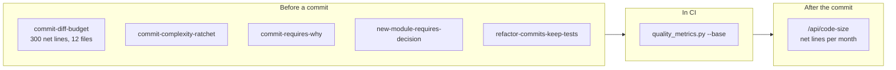

# MGCP Structured Coding Gates: Implementation Plan

Oct 5, 2026

## Goal and principles

Add three enforcing gates to MGCP's existing rules engine so code structure is checked by the PreToolUse hook, not requested in a prompt: a diff budget on every edit, a complexity ratchet on every commit, and a required intent record on every non-trivial commit. A revised feature workflow and a fresh-context simplifier pass sit around them.

- **Extend enforcement-as-data, build nothing parallel.** New precondition types go in `enforcement.py` (schema) and `pre-tool-dispatcher.py` (evaluator), like the six that exist. Rules stay in `~/.mgcp/enforcement_rules.json`.
- **Ratchet, never an absolute line.** 58 of 463 functions already exceed cyclomatic complexity 10. A fixed limit would block every commit that touches `server.py`. Changed code may not get worse; new code must meet the limits.
- **Gate decisions read git and the transcript, never `workflow_state.json`.** That file is shared and agent-writable, which is the v2.16 lesson from the apology gate.
- **Stdlib only in the hook.** Complexity comes from `ast`, size from `git diff --numstat`. CI runs the same code against the merge base, so there is one implementation.
- **Fail open on parse errors**, as the existing invariant requires. Each new rule ships in audit mode first and is promoted to enforce on evidence.
- **Every denial names its exit.** The reason says what to do next and which `MGCP_BYPASS:<scope>` turns it off.

## What MGCP already has

Most of the machinery exists. Only `pre-tool-dispatcher.py` can refuse a tool call; the other four hooks are advisory.

- **Rules engine.** `Trigger`, `Precondition` and `EnforcementRule` in `enforcement.py`; four seeded rules; six MCP tools to manage them. Trigger matches one `tool_name` (or `*`) plus an optional `command_match` (`git_subcommand`, `regex`, `contains`).
- **Precondition types today:** `tool_called_this_turn`, `tool_not_called_this_turn`, `staged_files_coupling`, `tool_input_glob`, `staged_files_forbid`, `staged_content_forbid`.
- **Git helpers in the hook:** `staged_files`, `staged_paths`, `staged_diff`, `staged_numstat` and `_added_lines`, all on `EvalContext`. The path and content rules read only what a commit adds, so a cleanup commit is never refused by them. The size rule reads both counts, because its question is net growth.
- **Transcript reader:** `_latest_apology` walks the transcript rather than shared state. The intent gate reuses that approach.
- **Workflow:** `feature-development` in `bootstrap_data/dev/workflows.yaml` has six steps: research, plan, document, execute, test, review.
- **Catalogue:** `add_catalogue_item(item_type="decision")` already stores rationale and alternatives.
- **Audit:** `gate_audit.jsonl` and the Enforcement instrument view already count fires per rule.

Baseline measured today on `src/` with a stdlib `ast` pass over 463 functions:

| Metric | Median | p90 | Max | Over proposed limit |
| --- | --- | --- | --- | --- |
| Cyclomatic complexity | 3 | 12 | 59 | 58 over 10 |
| Length (lines) | 17 | 65 | 344 | 31 over 80 |
| Max nesting depth | 1 | 3 | 10 | 19 over 4 |
| Parameters | 1 | 3 | 11 | 5 over 6 |

Worst offenders: `init_project.main` (CC 59, 344 lines), `pre-tool-dispatcher.main` (CC 50) and `_evaluate_precondition` (CC 42, 6 parameters). That last one matters here. It gains a positional parameter for each lazily loaded input, so adding three more types the current way is exactly the patchwork this plan exists to stop. Phase 0 refactors it first.

## Enforcement model

Gates fire at two checkpoints: before a commit (size, structure and intent), and in CI (the same checks against the merge base). The dashboard reads the size measurement again after the fact, so the same axis the gate holds is also the one you can watch over months.



Every gate now fires at the commit. The size gate used to fire on each edit,
and the section below says what that cost.

Read top to bottom as one task's life: edits accumulate under the budget, a commit turns them into reviewed history, and CI catches anything that was bypassed on the way.

## Gate 1: net diff budget

Rule `commit-diff-budget` refuses a commit whose staged source grows by more
than 300 net lines, or touches more than 12 files. Net means added minus
removed.

**Precondition type** `diff_budget` with `max_net_lines`, `max_files` and
`exclude_globs`.

**How it counts, with no state file:**

1. `git diff --cached --numstat` gives added and removed per staged path.
2. Paths matching `exclude_globs` are skipped. The shipped list is `tests/**`,
   `docs/**`, `*.md`, `**/bootstrap_data/**` and `sbom.cdx.json`. Writing tests
   is never what blows the budget, and the bill of materials is regenerated
   rather than written: one refresh is 3,543 added lines.
3. A binary file has no line count, so numstat prints `-` and the path is
   skipped.
4. Net is the sum of added minus the sum of removed, over the paths that are
   left.

**Deletions count in your favour.** A refactor that removes 800 lines and adds
320 passes a 300 line budget. Counting additions alone refused that commit,
which is the work the gate exists to encourage.

**This gate used to fire on every edit, and that was wrong in two ways.**

The first was the measurement. It summed the session's own Edit, Write and
MultiEdit calls and counted additions only, so the budget rose through a
session and never came down. Once a session passed 300, every later edit was
over budget for the rest of the session, including the edits that delete code.
The only exit left was `MGCP_BYPASS:size`, and an operator who has to type that
once types it every time. The audit log holds that state 14 times with the same
frozen number, 2,228 added lines against a budget of 300, spread over two days.

The second was the checkpoint. One edit cannot tell you whether a change is too
large, because the unit a reviewer reads is the commit. A commit is also one
decision rather than one per edit, it has two real exits, and it cannot strand
a session.

**Deny reason** prints the net count, the budget, the measured plus and minus,
and three exits: stage less, say in the message why the growth is the smallest
way to get the result, or remove the code the change makes redundant. Bypass
scope `size`. No git repo, or a git error, allows the call.

**The dashboard reads the same measurement.** `/api/code-size` reports net
lines per commit for every tracked project that is a git repository, with the
exclude list read from this rule rather than written again. The REM view draws
it per month. A chart on a different axis from the gate would trend something
nothing enforces.


**Schema change:** `Trigger` gains an optional `tool_names: list[str]`, so one rule covers Edit, Write and MultiEdit instead of three copies of the same rule.

## Gate 2: complexity ratchet

Rule `commit-complexity-ratchet` refuses a `git commit` whose staged Python makes any function worse on a metric where it is already over the limit, or adds a function that starts over a limit. Legacy code does not block work; it only stops getting worse.

**Precondition type** `staged_python_complexity` with a `limits` object.

| Metric | Limit | Measured as |
| --- | --- | --- |
| Cyclomatic complexity | 10 | 1 + branches, loops, handlers, comprehensions, boolean operands, match cases |
| Function length | 80 lines | `end_lineno - lineno + 1` |
| Nesting depth | 4 | deepest if, for, while, try, with or match, not counting nested defs |
| Parameters | 6 | positional plus keyword-only |
| File length | 1,000 lines | may not grow net once over the limit |

**How it decides:**

1. For each staged, non-deleted `.py` file, parse the staged blob (`git show :path`) and the HEAD blob (`git show HEAD:path`) with `ast`.
2. Key functions by qualified name (`Class.method`). A function absent at HEAD is new.
3. New function over any limit: deny. Existing function: deny if a metric crosses its limit, or rises while already over it.
4. A rename looks like delete plus add, so a renamed legacy function is held to the full limits. That is deliberate: a rename is the cheapest moment to split it.
5. Unparseable source on either side skips that file.

**Deny reason** lists each offending function with before and after values, for example `server.remove_catalogue_item: CC 38 → 41 (limit 10)`, and tells the agent to extract or flatten before retrying. Bypass scope `complexity`.

**One implementation, two callers.** The metric code lives in a stdlib module, `hook_templates/quality_metrics.py`, beside the dispatcher. The hook imports it from its own directory. CI runs it as a script against the merge base (`python src/mgcp/hook_templates/quality_metrics.py --base origin/main`), so a commit that bypassed the gate locally still fails the pull request.

**Banned-pattern checks ride the same pass** (see Banned patterns): broad excepts that swallow, and pass-through wrappers.

## Gate 3: intent records

Two rules make the why travel with the code: every commit over 40 added lines carries a `Why:` paragraph, and every commit that adds a module or a dependency is preceded by a catalogue decision in the same session.

**Rule `commit-requires-why`.** Precondition type `commit_message_requires` with `min_added_lines` (default 40), `pattern` (default `(?m)^Why: .{40,}`) and `exclude_globs` (same defaults as Gate 1). The message is read from the Bash command, the same place `commit-message-prose-style` reads it, which covers `-m` and heredocs. For `-F <file>` the hook reads the file; an unresolvable path fails open. Bypass scope `intent`.

The deny reason carries the template:

```
<subject, 50 chars or fewer>

What: <the change in one or two sentences>
Why: <the problem it solves or the constraint it meets>
Rejected: <alternatives considered and why not>
```

**Rule `new-module-requires-decision`.** Precondition type `transcript_tool_called` with `tool_name`, `input_match` (here `{"item_type": "decision"}`) and `when_staged_added` (default `src/**/*.py`, `pyproject.toml`). It walks the session transcript, as `_latest_apology` does, for an `add_catalogue_item` call with `item_type="decision"`. The transcript is used because it cannot be edited by the agent or another session, unlike `turn_tools_called`. Bypass scope `intent`.

**Why both.** The commit message stays with `git blame` for anyone reading the history. The catalogue decision is what `search_catalogue` and `query_lessons` return to the next session before it changes the same code, which is the loss-of-intent problem in practice.

## Workflow: refactor first, simplify last

The `feature-development` workflow gains two steps, `fit` and `simplify`, so the patchwork problem is handled before code is added and the bloat problem is handled before it is committed. Edit `bootstrap_data/dev/workflows.yaml`; existing step IDs stay unchanged so stored workflow state still resolves.

1. **Research** (existing).
2. **Plan** (existing, tightened). State the change in five bullets or fewer and name every file it touches. If the plan will not fit one diff budget, split it into commits now.
3. **Fit** (new, after `plan`). Ask: what would this code look like if the feature had been designed in from the start? Refactor to that shape in its own commit with a `Refactor:` subject. Tests must pass unchanged.
4. **Document** (existing).
5. **Execute** (existing). Gate 1 is live here.
6. **Test** (existing).
7. **Simplify** (new, after `test`). Spawn a fresh-context subagent that has not seen the work. Its only job: reduce lines, layers and parameters without changing public interfaces or tests, and report each banned pattern it finds. Apply its diff, or reject it and say why in the commit's `Why:`.
8. **Review** (existing, redefined). You read the diff. If you cannot explain it from memory, it does not merge. No hook can do this step.
9. **Commit.** Gates 2 and 3 fire, plus the existing rules.

**Enforcing step 3 with zero new code.** Rule `refactor-commits-keep-tests` uses existing types only: a trigger with one `regex` command match, `\bgit\b.*\bcommit\b[\s\S]*\bRefactor:`, and a `staged_files_forbid` precondition on `tests/**`. A refactor that needs test changes was not a pure refactor. Bypass scope `refactor`.

**Enforcing step 7, later.** Rule `large-change-requires-simplifier` (`transcript_tool_called`, tool `Agent`, `min_added_lines` 150) is seeded disabled and turned on only if audit data shows step 7 being skipped.

**Bug-fix workflow** gets the `simplify` step only. A fix should be small, and Gate 1 already keeps it that way.

## Banned patterns

Two of the seven are mechanically detectable and go in the Gate 2 pass; the other five are caught by the simplifier prompt and by lessons that the existing git gate already forces into view.

| Pattern | Example | Caught by |
| --- | --- | --- |
| Swallowed error | New `except Exception:` or bare `except:` whose body is only `pass`, `continue`, or `return` of a constant | Gate 2 `ast` check. Allowed with an `# mgcp: allow-broad-except <reason>` comment on the line, which the hook's own fail-open handlers need |
| Pass-through wrapper | New function whose body is one `return` of a call forwarding its own parameters unchanged | Gate 2 `ast` check |
| Speculative generality | Flag, config key or base class with one caller or one subclass | Simplifier, lesson |
| Unrequested compat shim | Alias, deprecated wrapper or dual code path nobody asked for | Simplifier, lesson |
| Second copy | The same logic in two places, as with the deleted package copy of the evaluator | Simplifier, lesson |
| Unneeded new file | A module where an edit to an existing one would do | Gate 3 `new-module-requires-decision`, simplifier |
| Dead code | Functions or branches nothing reaches | `vulture` in CI, advisory only |

**Lessons.** Add one lesson per pattern to `bootstrap_data/dev/code-quality.yaml`, tagged `code-quality`, with triggers on `implement`, `refactor` and `git commit`. `git-requires-query-lessons` already forces `query_lessons` before every commit, so they surface at the moment of commit without any new routing.

**Simplifier prompt** (stored as a workflow step `guidance`, so it is data):

```
You have not seen this change. Reduce it.
Keep public interfaces and tests unchanged; tests must still pass.
Remove: speculative flags or abstractions with one caller, compat shims,
wrappers that only forward, duplicated logic, handlers that hide errors.
Prefer editing existing code over adding files or layers.
Output a unified diff, then one line per change saying why.
If nothing should change, say so and stop.
```

## Configuration

Three schema additions in `enforcement.py`, all optional with defaults, so every existing `enforcement_rules.json` still loads.

- `Trigger.tool_names: list[str] = []`. Matches if `tool_name` matches or the name is in this list.
- `EnforcementRule.mode: Literal["enforce", "audit"] = "enforce"`. In audit mode the hook writes a `would_deny` event to `gate_audit.jsonl` and allows the call. Every new rule ships in audit mode.
- Four precondition types and their fields: `diff_budget`, `staged_python_complexity`, `commit_message_requires`, `transcript_tool_called`.

The new seeded rules, as they land in `DEFAULT_RULES`:

```json
[
  {
    "name": "commit-diff-budget",
    "mode": "audit",
    "trigger": {"tool_name": "Bash", "command_match": {"type": "git_subcommand", "subcommands": ["commit"]}},
    "preconditions": [{
      "type": "diff_budget",
      "max_net_lines": 300,
      "max_files": 12,
      "exclude_globs": ["tests/**", "docs/**", "*.md", "**/bootstrap_data/**", "sbom.cdx.json"]
    }],
    "bypass_scope": "size",
    "deny_reason": "This commit grows the source by more than its net budget. Stage less, or say why in the message."
  },
  {
    "name": "commit-complexity-ratchet",
    "mode": "enforce",
    "trigger": {"tool_name": "Bash", "command_match": {"type": "git_subcommand", "subcommands": ["commit"]}},
    "preconditions": [{
      "type": "staged_python_complexity",
      "limits": {"cyclomatic": 10, "length": 80, "depth": 4, "params": 6, "file_lines": 1000},
      "banned": ["swallowed_error", "pass_through_wrapper"]
    }],
    "bypass_scope": "complexity",
    "deny_reason": "Staged Python makes a function worse or adds one over a limit. Extract or flatten, then retry."
  },
  {
    "name": "commit-requires-why",
    "mode": "audit",
    "trigger": {"tool_name": "Bash", "command_match": {"type": "git_subcommand", "subcommands": ["commit"]}},
    "preconditions": [{
      "type": "commit_message_requires",
      "min_added_lines": 40,
      "pattern": "(?m)^Why: .{40,}",
      "exclude_globs": ["tests/**", "docs/**", "*.md", "**/bootstrap_data/**"]
    }],
    "bypass_scope": "intent",
    "deny_reason": "Commits over 40 added lines need a Why: paragraph. Template follows."
  },
  {
    "name": "new-module-requires-decision",
    "mode": "audit",
    "trigger": {"tool_name": "Bash", "command_match": {"type": "git_subcommand", "subcommands": ["commit"]}},
    "preconditions": [{
      "type": "transcript_tool_called",
      "tool_name": "mcp__mgcp__add_catalogue_item",
      "input_match": {"item_type": "decision"},
      "when_staged_added": ["src/**/*.py", "pyproject.toml"]
    }],
    "bypass_scope": "intent",
    "deny_reason": "A new module or dependency is staged with no catalogue decision this session. Record one with add_catalogue_item(item_type='decision')."
  }
]
```

`refactor-commits-keep-tests` and the disabled `large-change-requires-simplifier` complete the set. `add_enforcement_rule` already accepts any of these at runtime, so limits can be tuned without a release.

## Implementation phases

Six phases, each one commit series that passes its own gates. Phase 0 comes first because it is the refactor-first rule applied to this work.

### Phase 0: make room in the evaluator

Replace the growing positional parameter list of `_evaluate_precondition` with a lazy `EvalContext` (staged files, staged diff, non-deleted paths, transcript, project dir), and replace its if-chain with a dict of one handler function per type.

- [ ] Behavior identical: all 95 tests in `test_pre_tool_dispatcher.py` pass with no test edits
- [ ] `_evaluate_precondition` under CC 10; each handler under CC 10
- [ ] Each git subprocess still runs at most once per tool call
- [ ] `quality_metrics.py` created as a stdlib module beside the dispatcher; `init_project.py` installs it with the hooks; `--doctor` reports it missing

### Phase 1: schema and audit mode

- [ ] `Trigger.tool_names`, `EnforcementRule.mode` and the four precondition types added; an existing rules file round-trips unchanged
- [ ] Audit mode writes `would_deny` with rule name and details to `gate_audit.jsonl`, then allows
- [ ] Existing installs gain new default rules by name through `mgcp-bootstrap`, never by overwriting user rules (today `load_config` seeds defaults only when the file is missing)

### Phase 2: Gate 1, diff budget

- [ ] Counts match `git diff --numstat` on fixture repos for Edit, MultiEdit, Write-new and Write-overwrite
- [ ] Deletions and excluded globs never count; outside a git repo the call is allowed
- [ ] Hook latency under 150 ms on the MGCP repo

### Phase 3: Gate 2, complexity ratchet

- [ ] Unit tests per metric against hand-counted functions
- [ ] Ratchet cases: new function over limit denies; legacy function unchanged allows; legacy function worsened denies; legacy function improved allows
- [ ] Both banned-pattern checks, including the allow comment
- [ ] CI step runs `quality_metrics.py --base origin/main` and fails the job on violations

### Phase 4: Gate 3, intent records

- [ ] Message extraction covers `-m`, repeated `-m`, heredoc and `-F`
- [ ] Transcript walk finds a decision call and ignores one with another `item_type`
- [ ] Commit-message template appears verbatim in the deny reason

### Phase 5: workflow, lessons, promotion

- [ ] `fit` and `simplify` steps in `workflows.yaml`; existing step IDs unchanged
- [ ] Seven banned-pattern lessons seeded and returned by `query_lessons("git commit")`
- [ ] `refactor-commits-keep-tests` and disabled `large-change-requires-simplifier` seeded
- [ ] After two weeks of audit data, each rule promoted to enforce or retuned (see Validation)
- [ ] README, CLAUDE.md, CHANGELOG and hook `VERSION` updated together, as `version-bump-requires-readme` requires

## Validation

Each gate is proven three ways before it enforces: contract tests where the code runs, a replay over MGCP's own history, and two weeks of audit mode on real sessions.

**Contract tests.** New cases go in `tests/test_pre_tool_dispatcher.py`, which already tests the evaluator where it runs. Each precondition type gets an allow case, a deny case, a fail-open case and a bypass case, on temporary git repos. `quality_metrics.py` gets its own `tests/test_quality_metrics.py`.

**History replay.** A script fetches the last 200 commits (`git fetch --depth=200`) and runs Gates 1 to 3 against each commit's parent. Output: how many commits each rule would have refused, and the five largest offenders per rule. Read those five by hand. If most refusals are commits you would defend, the limit is wrong, not the commit.

**Audit mode.** Two weeks of `would_deny` events, read in the Enforcement instrument view.

| Signal | Promote to enforce when | Retune when |
| --- | --- | --- |
| `would_deny` per rule | Refusals you agree with dominate a sample of 10 | Most of the sample are commits you would defend |
| Bypass use per scope | Rare, with a reason each time | A scope is bypassed routinely |
| Functions over limit (from `quality_metrics.py --report`) | Count falls or holds | Count rises |
| Median added lines per commit | Falls or holds | Rises |

The last two rows are the outcome the system is for. If they do not move after enforcement, the gates are friction without effect and should be cut back.

## Open decisions

- **`server.py` and the file-length ratchet.** At 3,399 lines it is over the 1,000-line limit, so the ratchet blocks any new MCP tool there. Either split `server.py` by tool group (lessons, catalogue, workflows, enforcement, REM) before Phase 3 enforces, or exempt it and accept that it keeps growing.
- **Limits.** CC 10, 80 lines, depth 4 and 6 parameters are starting values. The history replay sets the real ones.
- ~~**Large functions.**~~ Settled 2026-10-05: a function that is legitimately one long sequence declares itself with `# mgcp: allow-size <reason>` rather than being split. See "Declaring a function deliberately large".
- **Diff budget size.** 300 added lines and 8 files is a guess at one reviewable sitting. Audit data decides.
- **Simplifier enforcement.** Seeded disabled. Turn it on only if audit shows step 7 skipped on large changes.
- **Scope beyond Python.** The dashboard JavaScript in `static/app/` gets Gate 1 and Gate 3 but no complexity ratchet. Adding one means a non-stdlib parser, which the hook cannot import.


## Declaring a function deliberately large

Some work is honestly one long function. A build script, an installer, an
argparse dispatcher: each branch is a flag, the sequence is flat, and splitting
it into eight helpers called once would scatter a procedure that reads top to
bottom.

Write the marker on the `def` line, on a decorator, or on the line directly
above, and that function is exempt from all four function limits:

```python
def main():  # mgcp: allow-size a CLI entry point: 12 flags, flat dispatch on each
```

The line above is not a convenience. A signature long enough to need the
exemption is often already at the line length limit, so the `def` line has no
room for the marker.

Three rules keep this from becoming a hole:

1. **A marker with no reason exempts nothing.** The reason is the point.
2. **Exempt functions are counted and named** in `--report`, each with its
   reason, so the list is something a person decided rather than something that
   drifted.
3. **A test pins the list.** Adding an exemption changes that test, so it
   happens on purpose.

Three functions carry it today, all in `init_project.py` and all depth 4:
`main` at cyclomatic complexity 59, `init_global_hooks` at 35 and
`init_claude_hooks` at 24.

The deeply nested functions in `server.py` do not. `remove_catalogue_item` is
depth 10 in 94 lines, which is not one ordered sequence by any reading. The
ratchet holds those at their current size instead.

### Why the escape is needed at all

The ratchet never asked anyone to split a large legacy function. It refuses only
a change that makes one worse. But that is exactly the problem for a build
script: adding a ninth supported LLM client to that argparse dispatch takes
cyclomatic complexity from 59 to 60, and the ratchet refuses the commit. That is
a refusal with nothing wrong behind it.

### Over limit is not refused

Around 100 functions here exceed a limit. None of them is refused, and the
report says so in its own output. A count of over-limit functions reads like a
backlog of failures, and it is not one. It is the starting position the ratchet
holds.


## What changed between this plan and the code

A design review ran six reviewers over this plan against the code before any of
it was built. It produced 64 findings, 12 of them blocking. Six changed the
design, and each one would have reached the operator's second machine.

**A git pull does not deploy a hook.** Every gate lives in
`pre-tool-dispatcher.py`, and Claude Code runs a COPY under `~/.mgcp/hooks`
named by absolute path in `settings.json`. Only `mgcp-init` rewrites that copy.
So pulling this work installs nothing until `mgcp-init` runs, and nothing said
so. `mgcp-init --doctor` now reports a deployed payload that is behind the
package, and reports a missing support module.

**`mode: "audit"` alone would have enforced.** A hook that predates the key
ignores it, which is neither a parse error nor a fail-open, so the rule
enforces. That is exactly the state after a pull and before `mgcp-init`. Every
new rule therefore also ships `enabled: false`, which every hook version has
always honoured.

**A disabled rule records nothing either.** The promotion decision rests on
`would_deny` rows, and a disabled rule writes none, so shipping disabled and
never enabling would make the gates decoration. `sync_enforcement_rules` turns
an audit rule on only once the installed hook payload matches the package, and
says which state it left things in and why.

**The delivery channel did not exist.** This plan said existing installs gain
new rules "through `mgcp-bootstrap`". Bootstrap has no enforcement code at all,
and the defaults reach disk only on a first install behind a check for a missing
file. `enforcement.merge_missing_defaults` adds by name and only by name: a rule
already present keeps every field and its position, because a populated rules
file is a customised one and a shipped rule may differ from its default on
purpose.

**A module-level import would have taken every gate dark.** The plan put the
metric code in a sibling module and had the hook import it. At module level an
`ImportError` is raised before `main`'s own handler exists, so the hook exits 1
with empty output, which the harness reads as allow. One missing file would have
disabled all ten rules including the git gate. It is imported inside its handler
instead, so the same failure costs one inert gate and leaves an audit row.

**The diff budget measured the wrong thing.** Counting the whole
HEAD-to-worktree delta refuses the first edit of any session that resumes
mid-feature, follows a soft reset, or runs during a merge. Git exits 0 in all of
those, so no fail-open engages and the session is stuck. It counts what this
session added, read from the transcript.

Smaller corrections: the cyclomatic definition is one per boolean OPERATOR, and
counting per operand puts 66 functions over the limit instead of the 58 the
baseline table states; `Trigger` and `Precondition` set `extra="forbid"`,
because every enforcement tool rewrites the whole file from the models and a
field the model does not know is silently dropped; `fnmatch` cannot express
`**`, so `src/**/*.py` missed a module added directly in `src/`, which is the
case `new-module-requires-decision` exists for; and the file-length row is a
separate exemption from a whole-file exclusion, so the five source files already
over 1,000 lines still have every function measured.

## What the history replay found

Run `python tests/history_replay.py` to reproduce. Over the last 200 commits as
of 2026-10-09, each compared against its first parent:

| Gate | Eligible | Would refuse | Rate |
| --- | --- | --- | --- |
| `commit-complexity-ratchet` | 200 | 69 | 34.5% |
| `commit-diff-budget`, over 300 net lines | 200 | 21 | 10.5% |
| `commit-requires-why`, over 40 added lines | 81 | 73 | 90.1% |

A `Why:` paragraph appears in 14 of 200 commit messages, so that rule refuses
most eligible commits the moment it leaves audit mode. That is correct for a
new convention and it is still worth knowing before promoting it.

The ratchet's refusals read as real on inspection: cyclomatic complexity 24 to
27, 31 to 44, nesting 6 to 8. So 10 stands as the starting limit rather than
being relaxed to fit.

Net lines per commit: median 2, maximum 4,917, against a budget of 300. The
median is 2 and not 19 because the measurement is now net. Half of this
project's commits change the codebase by two lines or fewer in either
direction, and the earlier figure counted only what they added.

## State as built

`commit-complexity-ratchet` is promoted. It ships enabled and enforcing, on the
evidence of its own audit rows: three findings and no false ones, which were a
new function at cyclomatic 12 and two broad excepts that discarded the error.
All three are fixed, so the gate holds a line the code already meets. The gate
refused its own promotion commit on first run, for a function that went from
100 lines to 103, and the fix was to split that function.

The other four gates ship disabled and in audit mode.

What remains is the part no code can do: `would_deny` rows for the four gates
still in audit, read in the Enforcement view, then promote or retune each rule
against the table in Validation.
